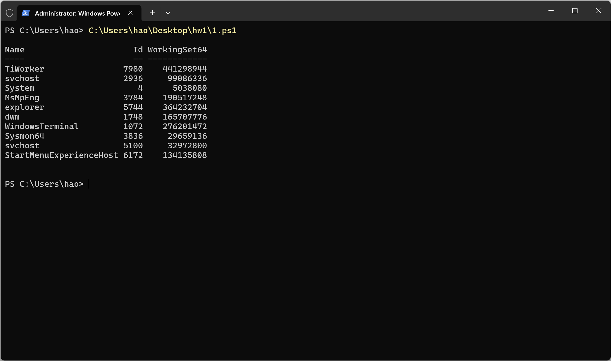
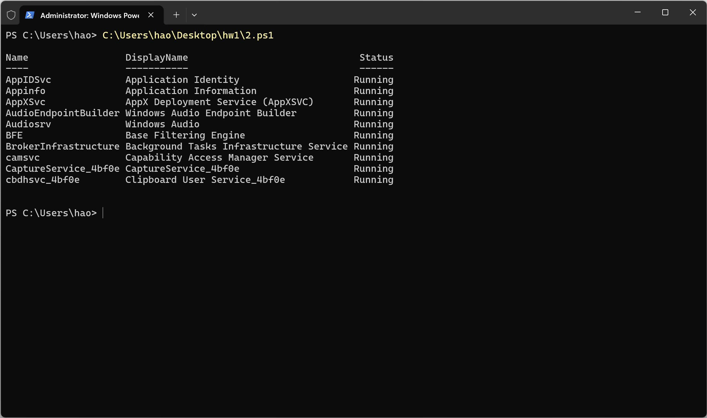
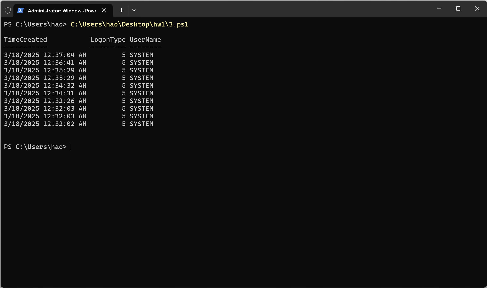
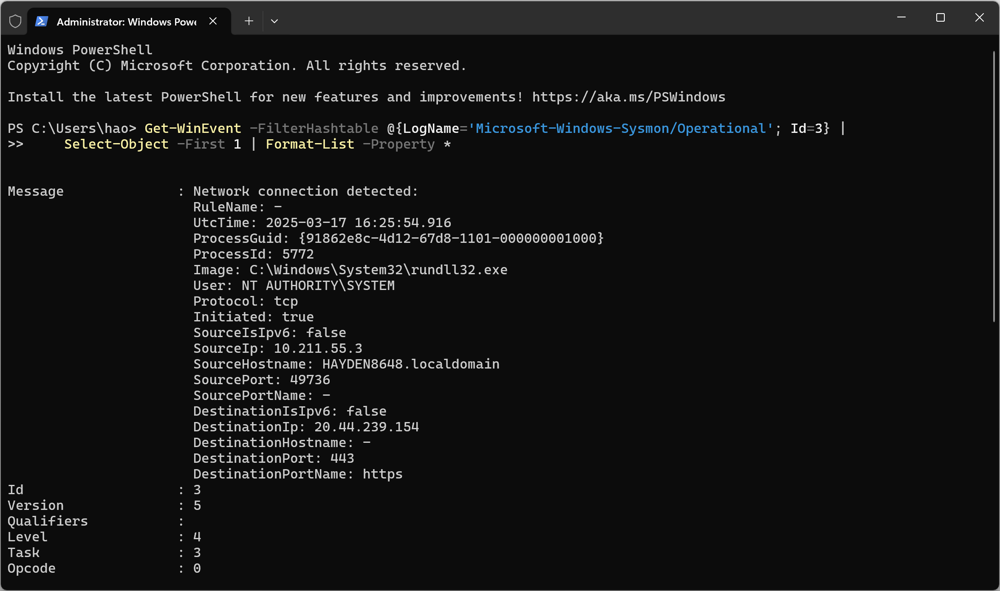
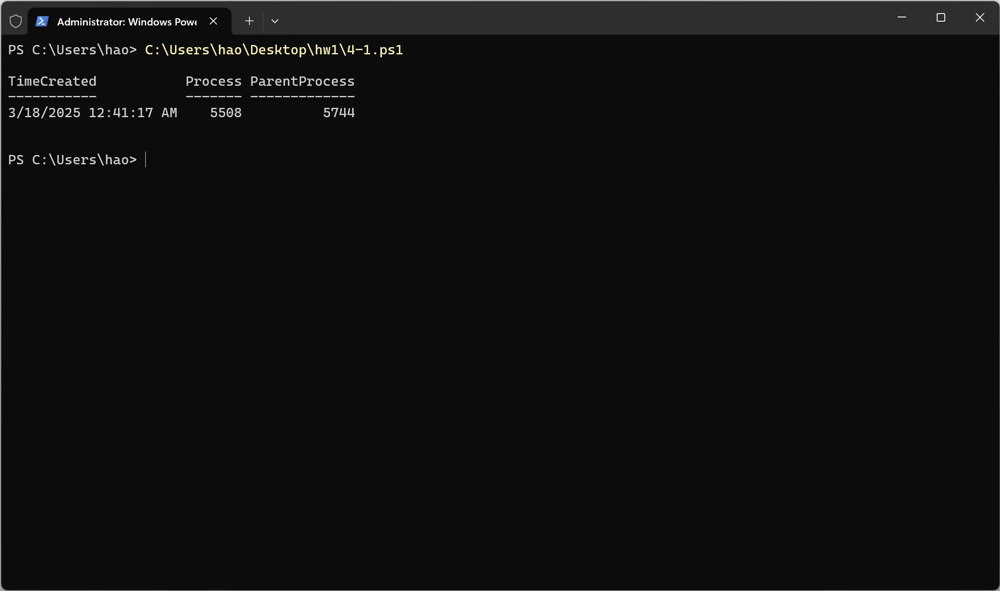
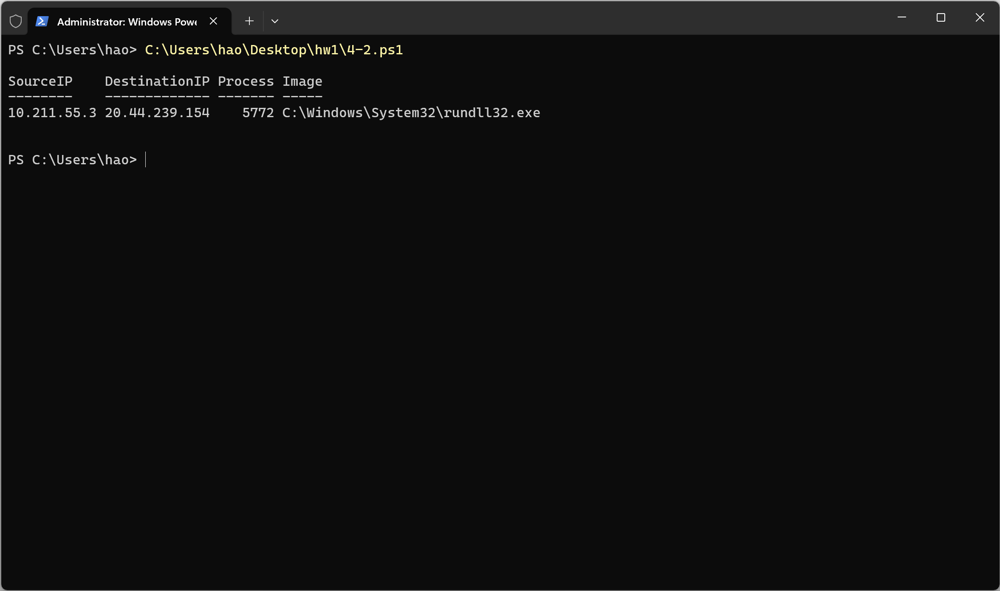
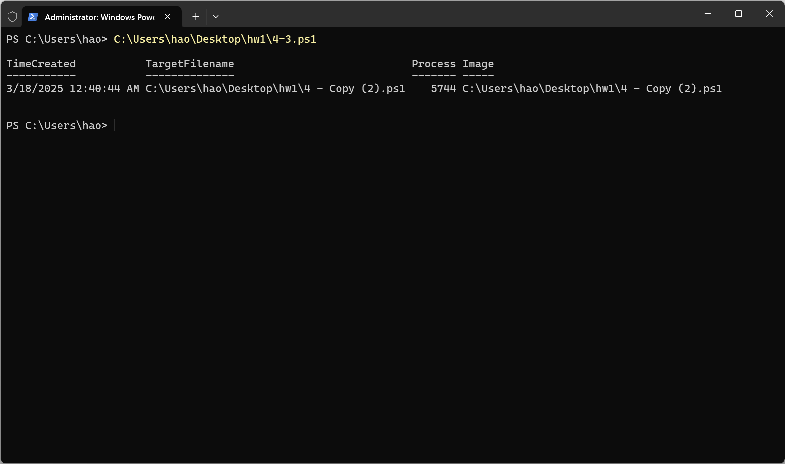

# Cybersecurity Homework 1

> Course No: MI5318701
>
> Course Name: 資訊系統與作業安全 Information System and Operational Security
>
> Professor: 邱建樺
>
> Author:
>
> - 張皓鈞 Hayden Chang (B11030202)
> - 鄭健廷 Allen Cheng (B11130225)
> - 高靜宜 Genie Gao (M11309208)

## Windows 安全監控與事件分析報告

​ 在整個過程中，我們利用內建的 PowerShell 指令來查詢系統進程、服務及安全事件，並進一步透過 Sysmon 來監控進程創建、網路連線以及檔案建立事件。

### 1. 查詢前 10 筆當前執行的進程列表

```powershell
Get-Process | Sort-Object -Descending CPU | Select-Object -First 10 Name, Id, WorkingSet64
```

​ 在此部分，我們採用了 `Get-Process` 指令取得所有正在執行的進程。考量到我們希望能列出“前 10 筆”最重要的資訊，腳本先透過 `Sort-Object -Descending CPU` 依 CPU 使用率進行排序，再利用 `Select-Object -First 10` 來選取前 10 筆資料，最後顯示進程名稱、PID 與記憶體使用量（`WorkingSet64`）。

> **重點說明：**
>
> - **排序依據：** 這裡選擇以 CPU 使用率作為排序依據，當然也可以根據記憶體使用量或其他參數排序。
> - **WorkingSet64：** 此屬性代表進程目前佔用的實體記憶體大小，單位為位元組。



### 2. 查詢前 10 筆正在執行的 Windows 服務

```powershell
Get-Service | Where-Object { $_.Status -eq "Running" } | Select-Object -First 10 Name, DisplayName, Status
```

​ 此部分我們使用 `Get-Service` 來取得系統上所有服務，再以 `Where-Object { $_.Status -eq "Running" }` 篩選出狀態為「Running」的服務。隨後利用 `Select-Object -First 10` 取出前 10 筆資料，並顯示服務名稱、顯示名稱及狀態。

> **重點說明：**
>
> - **篩選服務：** 使用 `Where-Object` 有助於精準定位當前正在執行的服務，確保報告內容只包含有效運作中的項目。



### 3. 查詢最近 24 小時內前 10 筆的登入成功事件 (Event ID: 4624)

```powershell
$startTime = (Get-Date).AddHours(-24)
Get-WinEvent -FilterHashtable @{LogName='Security'; Id=4624; StartTime=$startTime} |
Select-Object -First 10 TimeCreated, @{Name='LogonType'; Expression={$_.Properties[8].Value}}, @{Name='UserName'; Expression={$_.Properties[5].Value}}
```

​ 在安全性日誌中，事件 ID 4624 表示一次登入成功的事件。為了達到題目要求，我們先計算出 24 小時前的時間（利用 `(Get-Date).AddHours(-24)`），再透過 `Get-WinEvent` 結合 `FilterHashtable` 指定查詢範圍：LogName 為 Security、事件 ID 為 4624，並限制開始時間。

接著，為了輸出需要的資訊：

- **TimeCreated**：直接顯示事件發生的時間。
- **LogonType** 與 **UserName**：這兩個欄位資料並非屬性名稱，而是存放在事件物件的 `Properties` 陣列中。根據查詢與觀察（例如在 Event Viewer 詳細資訊中檢查事件的各個欄位），我們發現登入類型對應 Properties 陣列中索引值 8（第 9 個元素），而使用者帳號則位於索引值 5（第 6 個元素）。

> **尋找屬性索引的過程：**
> 在面對 Windows 安全事件時，最直接的方法就是在 Event Viewer 中選取一筆 4624 事件，然後切換到「詳細資訊」頁籤，觀察每個屬性所對應的位置。此外，也可以使用 PowerShell 指令 `Get-WinEvent ... | Format-List *` 列出所有欄位，藉此判斷哪個索引對應所需資料。



### 4. Sysmon 安裝與事件分析

​ Sysmon（System Monitor）是一個由 Sysinternals 提供的工具，能夠深入監控系統中的各項事件。這一部分分成兩個主要階段：Sysmon 的安裝設定與事件查詢分析。

#### 4.1 Sysmon 的安裝與設定

```powershell
# 下載 Sysmon
$sysmonZip = "$env:TEMP\Sysmon.zip"
$sysmonDir = "$env:TEMP\Sysmon"
$sysmonExe = "$sysmonDir\Sysmon64.exe"
$configFile = "$sysmonDir\sysmonconfig.xml"

Invoke-WebRequest -Uri "https://download.sysinternals.com/files/Sysmon.zip" -OutFile $sysmonZip

# 解壓縮 Sysmon.zip
Expand-Archive -Path $sysmonZip -DestinationPath $sysmonDir -Force

# 下載 Sysmon 設定檔
Invoke-WebRequest -Uri "https://raw.githubusercontent.com/SwiftOnSecurity/sysmon-config/master/sysmonconfig-export.xml" -OutFile $configFile

# 安裝 Sysmon
Start-Process -FilePath $sysmonExe -ArgumentList "-accepteula -i" -Wait

# 載入設定
Start-Process -FilePath $sysmonExe -ArgumentList "-c $configFile" -NoNewWindow -Wait

# 清理安裝檔案
Remove-Item -Path $sysmonZip -Force
```

1. **下載與解壓縮：**
   利用 `Invoke-WebRequest` 指令下載 Sysmon 的壓縮檔，接著使用 `Expand-Archive` 將壓縮檔解壓到指定資料夾中。
2. **下載設定檔：**
   從 SwiftOnSecurity 的 GitHub 下載 Sysmon 設定檔（sysmonconfig.xml），這份設定檔中包含了詳細的事件篩選規則與輸出格式。
3. **安裝與載入設定：**
   使用 `Start-Process` 指令呼叫 Sysmon 執行檔，並傳入 `-accepteula -i` 引數以接受授權並進行安裝。安裝完成後，再利用 `-c` 引數載入設定檔，確保 Sysmon 依照我們的需求進行監控。
4. **清理安裝檔案：**
   安裝過程完成後，將下載的壓縮檔清除，以保持系統環境的整潔。

#### 4.2 Sysmon 事件的查詢與屬性索引解析

​ Sysmon 安裝完畢後，系統會產生大量監控事件，這些事件記錄在 `Microsoft-Windows-Sysmon/Operational` 日誌中。接下來，我們根據事件 ID 分別查詢不同類型的事件。

##### 4.2.0. 找出所需資料的屬性索引（Index）方法

**範例：** 列出 `Event ID 3` 事件的所有屬性，找出所需的欄位索引，如 `SourceIP` 和 `DestinationIP` 的索引為 `9` 和 `14` 。

```powershell
Get-WinEvent -FilterHashtable @{LogName='Microsoft-Windows-Sysmon/Operational'; Id=3} |
    Select-Object -First 1 | Format-List -Property *
```



##### 4.2.1 進程創建事件 (Event ID: 1)

```powershell
Get-WinEvent -FilterHashtable @{LogName='Microsoft-Windows-Sysmon/Operational'; Id=1} |
    Select-Object -Property TimeCreated, @{Name='Process'; Expression={($_.Properties[3].Value)}}, @{Name='ParentProcess'; Expression={($_.Properties[19].Value)}} |
    Select-Object -First 1 | Format-Table -AutoSize
```

- **查詢目標：**
  使用 `Get-WinEvent` 指令篩選出事件 ID 為 1 的進程創建事件，並利用 `Select-Object` 自定義輸出欄位，其中包括：
  - **TimeCreated**：事件發生的時間。
  - **Process**：一般對應 Properties 陣列中某一固定位置（本範例中採用索引值 3）。
  - **ParentProcess**：同理，從 Properties 陣列中取得父進程資訊（本範例中使用索引值 19）。
- **索引的取得方式：**
  通常會先在 Event Viewer 中開啟一筆進程創建事件，查看「詳細資訊」頁籤以了解每個欄位的位置，再結合 Sysmon 的官方文件，確認各個資料的索引值。



##### 4.2.2 網路連線事件 (Event ID: 3)

```powershell
Get-WinEvent -FilterHashtable @{LogName='Microsoft-Windows-Sysmon/Operational'; Id=3} |
    Select-Object -Property @{Name='SourceIP'; Expression={($_.Properties[9].Value)}},
                          @{Name='DestinationIP'; Expression={($_.Properties[14].Value)}},
                          @{Name='Process'; Expression={($_.Properties[3].Value)}},
                          @{Name='Image'; Expression={($_.Properties[4].Value)}} |
    Select-Object -First 1 | Format-Table -AutoSize
```

- **查詢目標：**
  針對網路連線事件，我們需要取得來源 IP、目的 IP、連線應用程式等資料。
  利用 `Select-Object` 自定義欄位，分別從事件 Properties 陣列中提取來源 IP（索引值 9）、目的 IP（索引值 14）以及與連線相關的應用程式資訊（索引值 3 與 4）。
- **索引尋找過程：**
  與進程創建事件相似，透過檢查完整事件屬性，並參照 Sysmon 文件來確認正確的索引值，這對於提取正確資訊非常重要。



##### 4.2.3 檔案建立事件 (Event ID: 11)

```powershell
Get-WinEvent -FilterHashtable @{LogName='Microsoft-Windows-Sysmon/Operational'; Id=11} |
    Select-Object -Property TimeCreated, @{Name='TargetFilename'; Expression={($_.Properties[5].Value)}}, @{Name='Process'; Expression={($_.Properties[3].Value)}}, @{Name='Image'; Expression={($_.Properties[4].Value)}} |
    Select-Object -First 1 | Format-Table -AutoSize
```

- **查詢目標：**
  查詢檔案建立事件時，我們主要關注兩個資訊：建立的檔案名稱及該動作所屬的進程。
  腳本中透過 `Select-Object` 指令，自定義輸出欄位，從 Properties 陣列中分別抽取檔案名稱（TargetFilename）及進程名稱。
- **注意事項：**
  由於 Sysmon 的事件結構可能因設定或版本差異而略有不同，有時同一事件中可能會出現相似或重複的索引數值。在這種情況下，需特別注意對應文件或實際觀察輸出來確保提取的資料正確無誤。



### 綜合心得

​ 在整個作業實作的過程中，我們不僅學習了如何使用 PowerShell 指令查詢系統中各項資訊，更體驗到如何從複雜的事件資料中找出所需欄位的索引。以下是我在實作中的幾點心得：

- **反覆驗證：**
  透過多次執行指令並觀察輸出結果，能夠幫助我們快速發現資料提取的偏差，並及時做出調整。
- **借助工具：**
  使用 Event Viewer 查看事件詳細資訊以及運用 `Format-List *` 指令，是確認各屬性索引的有效方法。
- **參考官方文件：**
  對於 Sysmon 這類工具，官方文件提供了極具參考價值的事件結構說明，能夠幫助我們準確設置腳本，避免因版本差異導致的錯誤。

​ 本次作業不僅增強了對 PowerShell 腳本撰寫的熟悉度，也讓我更深刻理解到系統監控中細節的重要性。這些經驗對日後進行更高階的安全監控與事件分析工作將大有裨益。
