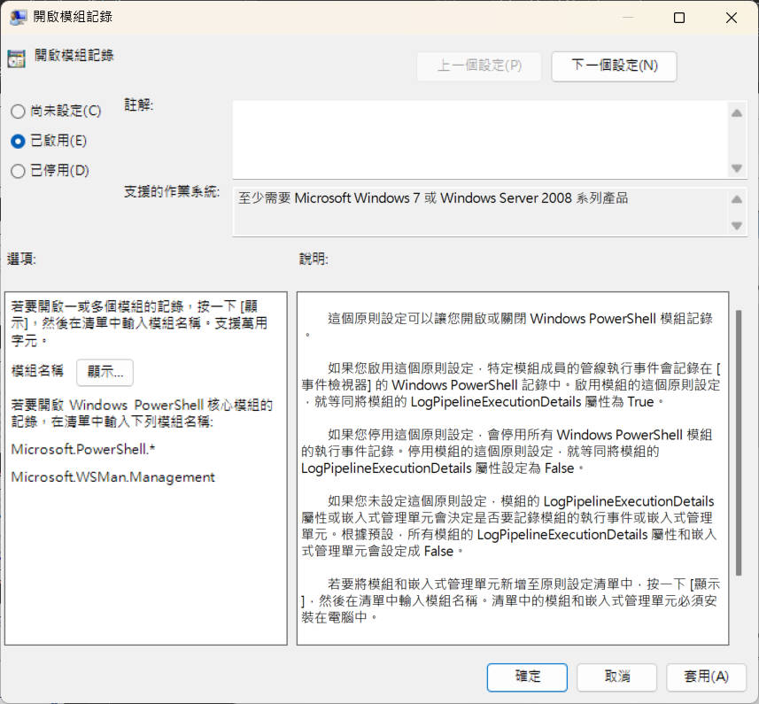
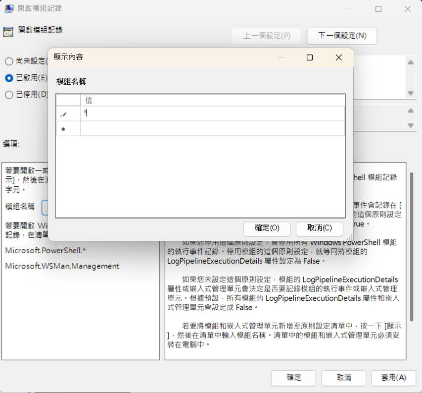
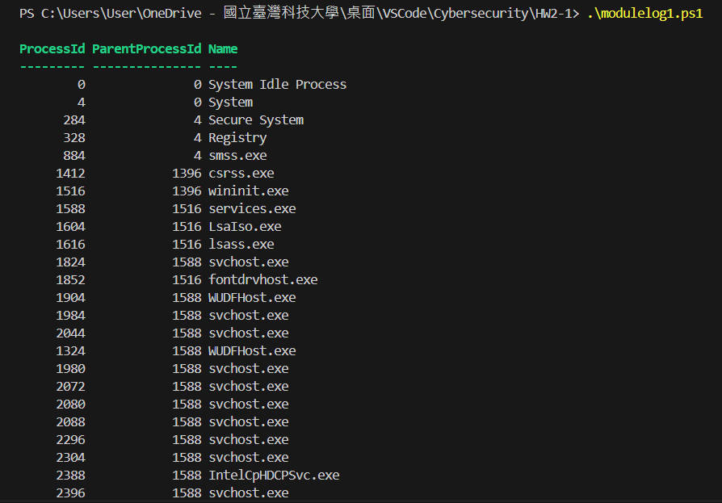
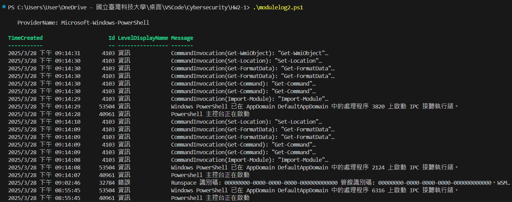
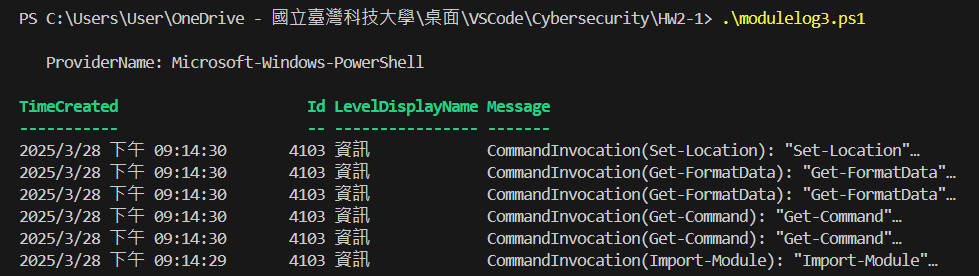
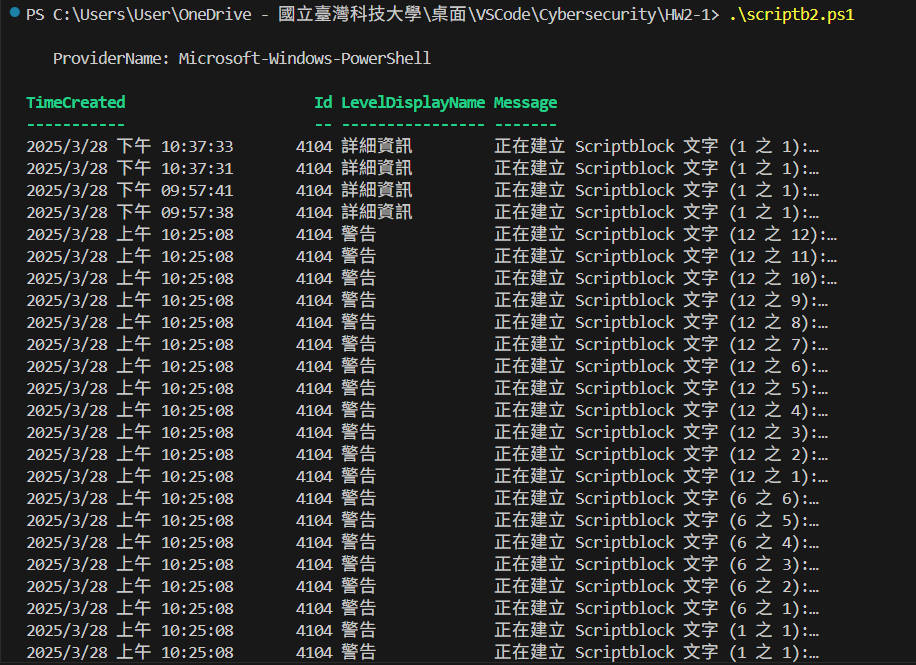
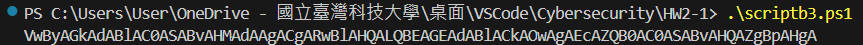
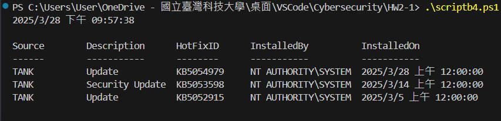
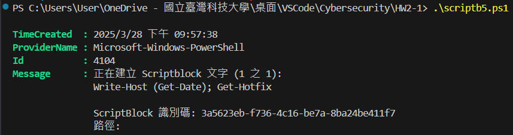
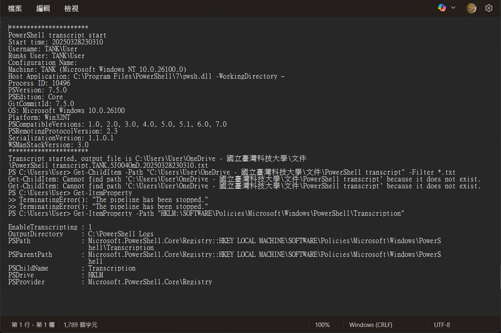

# Cybersecurity Homework 2

> Course No: MI5318701
>
> Course Name: 資訊系統與作業安全 Information System and Operational Security
>
> Professor: 邱建樺
>
> Author:
>
> - 張皓鈞 Hayden Chang (B11030202)
> - 鄭健廷 Allen Cheng (B11130225)
> - 高靜宜 Genie Gao (M11309208)

# 第一題

## 瞭解並啟用 PowerShell 的三種常見紀錄功能
 
 在第一題中，我們透過群組原則編輯器 gpedit.msc 開啟三種日誌功能，再使用內建 PowerShell 指令查詢 PowerShell 的事件紀錄，最後比較三種日誌的事件記錄的內容差異。

### 1.  透過群組原則 (`gpedit.msc`) 啟用 PowerShell 日誌功能

#### (1) 開啟本機群組原則編輯器
```shell
Win + R → 輸入 gpedit.msc → 按 Enter
```

 #### (2) 啟用 Module Logging
- 位置：`電腦設定 → 系統管理範本 → Windows 元件 → Windows PowerShell`
- 設定：啟用「啟用 PowerShell 模組記錄」(`Enable Module Logging`)
- 新增要記錄的模組名稱（可輸入 `*` 代表所有模組）

#### (3) 啟用 Script Block Logging
- 位置：與 Module Logging 相同
- 設定：啟用「啟用記錄 PowerShell 指令碼區塊」(`Enable Script Block Logging`)

#### (4) 啟用 Transcript Logging
- 位置：`電腦設定 → 系統管理範本 → Windows 元件 → Windows PowerShell`
- 設定：啟用 **「啟用 PowerShell 轉錄」** (`Turn on PowerShell Transcription`)
- 設定存放日誌的路徑（如 `C:\PowerShell_Logs`）




---

### 2. 撰寫與執行 PowerShell 測試指令

```powershell
Get-WmiObject -Class Win32_Process | Format-Table ProcessId, ParentProcessId, Name; Write-Host (Get-Date)
```

在此部分，我們採用了 `Get-WmiObject -Class Win32_Process` 指令來查詢系統中所有正在執行的進程。考量到我們希望能列出"進程 ID (ProcessId)"、"父進程 ID (ParentProcessId)"及"進程名稱 (Name)"，腳本透過 `Format-Table ProcessId, ParentProcessId, Name` 以表格格式輸出這些關鍵資訊，最後利用 `Write-Host (Get-Date)` 顯示執行當下的日期與時間，以便日誌記錄或後續分析。

> **重點說明：**
>
> - **進程 ID (ProcessId)：**  每個進程的唯一識別碼，可用來追蹤特定進程的狀態。
> - **父進程 ID (ParentProcessId)：**  顯示該進程是由哪個進程啟動的，這對於分析進程關係、偵測惡意軟體特別重要。
> - **進程名稱 (Name)：**  進程的可執行檔名稱，例如 explorer.exe、chrome.exe 等。
> - **查詢方式：**  `Get-WmiObject -Class Win32_Process` 使用 WMI (Windows Management Instrumentation) 來檢索進程資訊。
> - **執行時間記錄：**  `Write-Host (Get-Date)` 可確保每次查詢時都能標記時間，以利日誌分析與問題追蹤。



---

### 3. 查詢 PowerShell 事件紀錄

#### (1) 查詢 PowerShell 作業事件日誌

```powershell
Get-WinEvent -FilterHashtable @{Logname='Microsoft-Windows-PowerShell/Operational'}
```

> **重點說明：**
>
> - **查詢方式：**  `Get-WinEvent` 是效能較佳的 Windows 事件日誌查詢工具，適合大範圍檢索。




#### (2) 查詢 Event ID 4103（Module Logging）

```powershell
Get-WinEvent -FilterHashtable @{Logname='Microsoft-Windows-PowerShell/Operational'; StartTime="2025/3/28 下午 09:14:29"; EndTime="2025/3/28 下午 09:14:31"; ID=4103}
```



#### (3) 查詢 Event ID 4104（Script Block Logging）

```powershell
Get-WinEvent -FilterHashtable @{Logname='Microsoft-Windows-PowerShell/Operational'; ID=4104}
```



#### (4) PowerShell 指令 Base64 編碼處理（Script Block Logging 腳本測試）

```powershell
$Command = 'Write-Host (Get-Date); Get-Hotfix'
$Bytes = [System.Text.Encoding]::Unicode.GetBytes($Command)
$EncodedCommand = [Convert]::ToBase64String($Bytes)
$EncodedCommand
```

在此部分，我們採用了 `$Command` 變數來存放 PowerShell 指令 (`Write-Host (Get-Date); Get-Hotfix`)，該指令的功能是先輸出目前日期時間，再查詢系統已安裝的更新 (Hotfix)。
接著，腳本透過 `[System.Text.Encoding]::Unicode.GetBytes($Command)` 將指令轉換為 Unicode 編碼的位元組陣列，再利用 `[Convert]::ToBase64String($Bytes)` 將其編碼為 Base64 格式，最後儲存至 `$EncodedCommand` 變數。

**主要用途：**
  - **遠端執行 PowerShell 指令**：可透過 `powershell.exe -EncodedCommand $EncodedCommand` 在遠端系統執行這段 Base64 編碼的指令，而不必使用明文指令，避免特殊字元解析問題。
  - **繞過 PowerShell 命令行限制**：某些環境（如 CMD、某些端點安全解決方案）可能會 限制直接輸入 PowerShell 指令，但透過 Base64 編碼可以 繞過部分限制，讓指令仍然能夠執行。
  - **防止指令被輕易檢視或修改**：雖然 Base64 不是加密技術，但將指令轉換為 Base64 可以 提高一定的隱蔽性，減少指令直接暴露的風險。
  - **惡意程式（Malware）可能利用此技術**：攻擊者常用 Base64 編碼來 隱藏惡意指令，以逃避靜態分析與偵測。

> **重點說明：**
>
> - **Base64 編碼：**  這是一種將二進位資料轉換為 ASCII 字符的方式，常用於傳輸 PowerShell 指令或避免特殊字元問題。



##### (4.1) 執行 Base64 編碼

```powershell
powershell -Encoded VwByAGkAdABlAC0ASABvAHMAdAAgACgARwBlAHQALQBEAGEAdABlACkAOwAgAEcAZQB0AC0ASABvAHQAZgBpAHgA
```

在此部分，`-EncodedCommand` 參數允許 PowerShell 執行經過 Base64 編碼的命令，避免直接暴露明文指令。
解碼後的實際指令為：`Write-Host (Get-Date); Get-Hotfix`。
其中：
- `Write-Host (Get-Date)` 會輸出當前系統時間。
- `Get-Hotfix` 會查詢並列出系統已安裝的 Windows 更新補丁 (Hotfix)。



##### (4.2) 執行 Base64 編碼後查詢 Event ID 4104 詳細資料

```powershell
Get-WinEvent -FilterHashtable @{Logname='Microsoft-Windows-PowerShell/Operational'; StartTime="2025/3/28 下午 09:57:37"; EndTime="2025/3/28 下午 09:57:39"; ID=4104} | Format-List
```

從輸出結果中可以發現，Message 裡的會呈現出解碼後的實際指令 `Write-Host (Get-Date); Get-Hotfix`。



#### (5) 查詢 Transcript Logging 記錄

```powershell
Start-Transcript
```

打開 `C:\PowerShell_Logs\` 內的 `.txt` 檔案，檢視記錄內容：



---

### 4. 比較三種日誌的內容差異

| 日誌類型 | 事件 ID | 記錄內容 | 優點 | 缺點 |
|----------|---------|----------|------|------|
| **Module Logging** | `4103` | 記錄載入的 PowerShell 模組和使用的 cmdlet | 監控特定模組使用情況 | 不會記錄完整指令碼 |
| **Script Block Logging** | `4104` | 記錄執行的指令碼內容，包括動態產生的指令碼 | 可用於審查指令碼內容 | 可能產生大量日誌，影響效能 |
| **Transcript Logging** | `N/A (純文字)` | 完整記錄 PowerShell 執行的所有輸入輸出 | 提供完整執行紀錄 | 不支援事件檢視器篩選 |

---

### 5. 結論
透過這三種日誌功能，可以更有效地監控和審查 PowerShell 執行的內容，提升系統安全性！