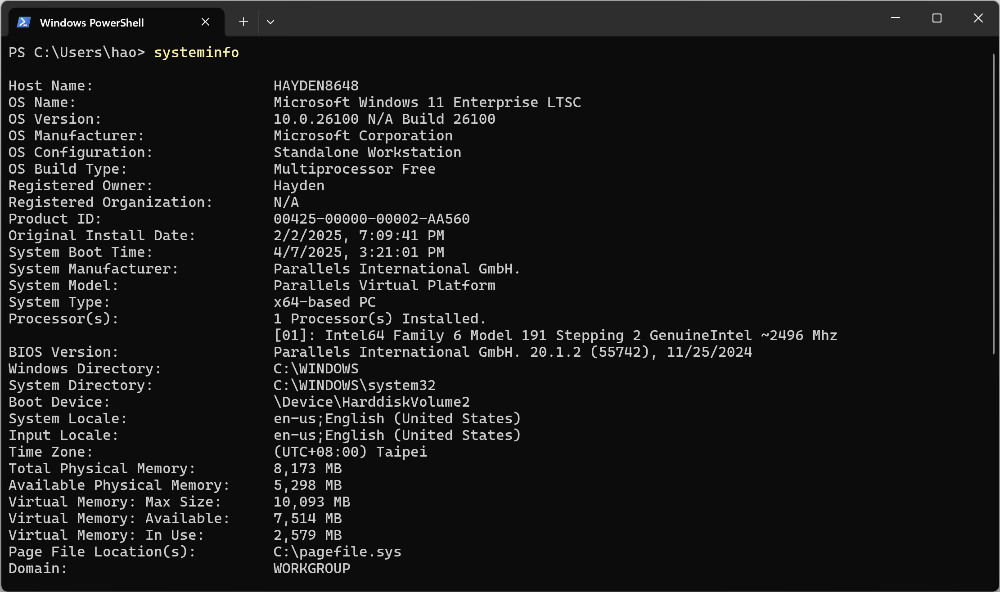
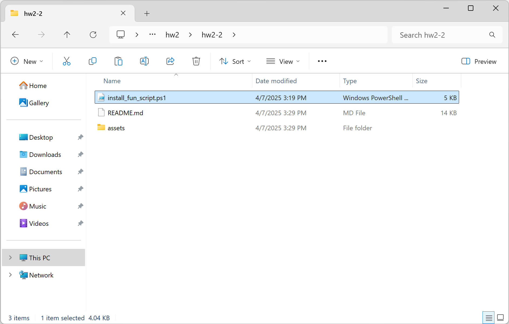
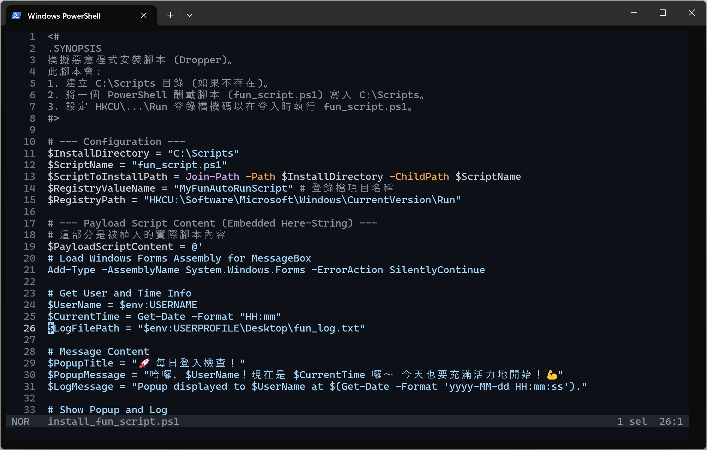
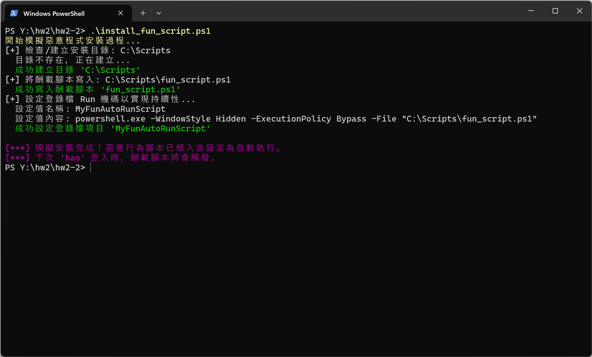
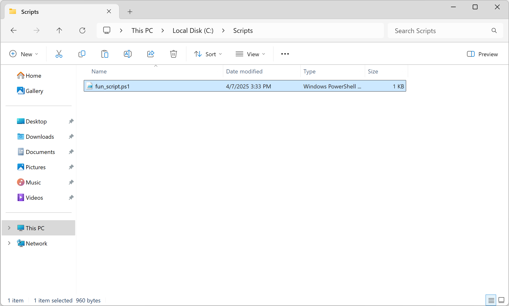
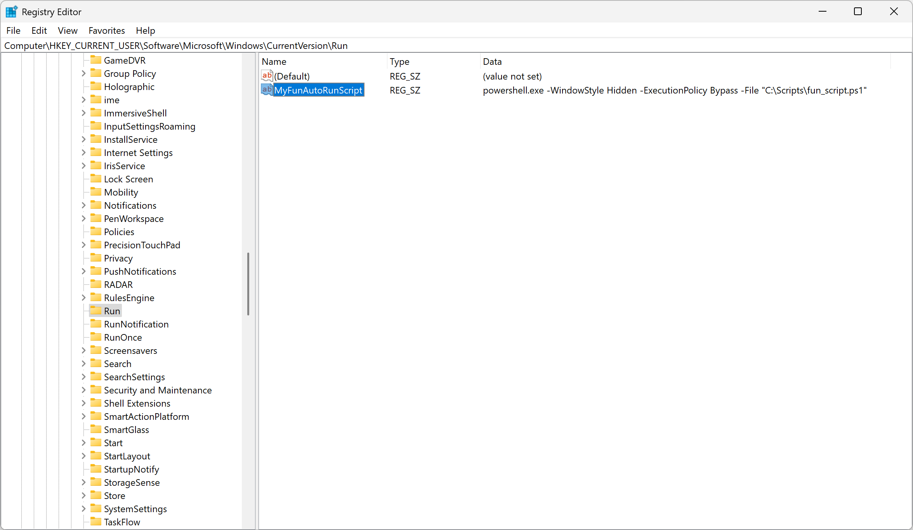
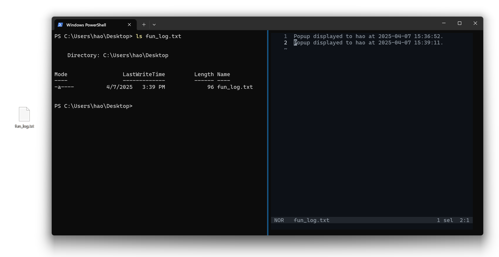
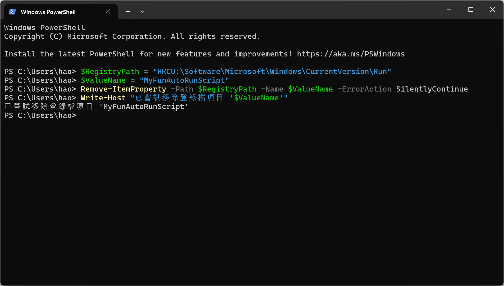

# Cybersecurity Homework 2-2

> Course No: MI5318701
>
> Course Name: 資訊系統與作業安全 Information System and Operational Security
>
> Professor: 邱建樺
>
> Author:
>
> - 張皓鈞 Hayden Chang (B11030202)
> - 鄭健廷 Allen Cheng (B11130225)
> - 高靜宜 Genie Gao (M11309208)

## 目錄

[toc]


## 模擬惡意程式感染：使用自動化腳本建立登錄檔自動執行機制

本實驗旨在模擬惡意程式感染系統並建立持續性（Persistence）的過程。我們將利用 Windows 登錄檔（Registry）的 `Run` 機碼來設定程式在使用者登入時自動執行，但與基礎練習不同的是，本次實驗將 **自動化「植入」與「設定」的過程**，以更真實地模擬一個 dropper 或 installer 類型的惡意腳本行為。

實驗目標：

1. 撰寫一個「安裝腳本」(`install_fun_script.ps1`)。
2. 此安裝腳本執行時，會自動將一個包含「有趣」功能（彈出歡迎視窗並記錄）的「酬載腳本」(`fun_script.ps1`) 寫入到指定位置。
3. 安裝腳本接著會自動修改 `HKEY_CURRENT_USER\Software\Microsoft\Windows\CurrentVersion\Run` 登錄檔機碼，設定酬載腳本 (`fun_script.ps1`) 在使用者登入時自動執行。
4. 驗證酬載腳本是否成功實現自動執行，並觀察其行為。
5. 了解此類自動化感染與持久化技術的原理、風險及防範。

實驗主要使用 Windows內建的 PowerShell 工具來模擬此過程。


### 1. 實作環境

- **作業系統：** Windows 11 Enterprise LTSC 10.0.26100 Build 26100
- **主要工具：** Windows PowerShell, Windows Terminal




### 2. 實作步驟

### 2.1 撰寫模擬安裝腳本 (`install_fun_script.ps1`)

此腳本是模擬使用者不慎執行的「惡意」安裝程式。它包含了「酬載腳本」的內容，並負責將其寫入檔案系統及設定登錄檔。

**安裝腳本功能：**

- 定義酬載腳本的安裝路徑 (`C:\Scripts\fun_script.ps1`) 和登錄檔項目名稱。
- 檢查並建立安裝目錄 (`C:\Scripts`)。
- 將內嵌的酬載腳本內容寫入到 `C:\Scripts\fun_script.ps1`。
- 自動設定 HKCU 的 Run 登錄檔機碼，使其指向新建立的 `fun_script.ps1`。
- 提供執行的回饋訊息。

**安裝腳本 (`install_fun_script.ps1`) 內容：**

PowerShell

```powershell
<#
.SYNOPSIS
模擬惡意程式安裝腳本 (Dropper)。
此腳本會:
1. 建立 C:\Scripts 目錄 (如果不存在)。
2. 將一個 PowerShell 酬載腳本 (fun_script.ps1) 寫入 C:\Scripts。
3. 設定 HKCU\...\Run 登錄檔機碼以在登入時執行 fun_script.ps1。
#>

# --- Configuration ---
$InstallDirectory = "C:\Scripts"
$ScriptName = "fun_script.ps1"
$ScriptToInstallPath = Join-Path -Path $InstallDirectory -ChildPath $ScriptName
$RegistryValueName = "MyFunAutoRunScript" # 登錄檔項目名稱
$RegistryPath = "HKCU:\Software\Microsoft\Windows\CurrentVersion\Run"

# --- Payload Script Content (Embedded Here-String) ---
# 這部分是被植入的實際腳本內容
$PayloadScriptContent = @'
# Load Windows Forms Assembly for MessageBox
Add-Type -AssemblyName System.Windows.Forms -ErrorAction SilentlyContinue

# Get User and Time Info
$UserName = $env:USERNAME
$CurrentTime = Get-Date -Format "HH:mm"
$LogFilePath = "$env:USERPROFILE\Desktop\fun_log.txt"

# Message Content
$PopupTitle = "🚀 每日登入檢查！"
$PopupMessage = "哈囉，$UserName！現在是 $CurrentTime 囉～ 今天也要充滿活力地開始！💪"
$LogMessage = "Popup displayed to $UserName at $(Get-Date -Format 'yyyy-MM-dd HH:mm:ss')."

# Show Popup and Log
if ([System.Windows.Forms.MessageBox]) {
    [System.Windows.Forms.MessageBox]::Show($PopupMessage, $PopupTitle, [System.Windows.Forms.MessageBoxButtons]::OK, [System.Windows.Forms.MessageBoxIcon]::Information) | Out-Null
} else {
    $LogMessage = "Failed to load System.Windows.Forms. Popup not displayed at $(Get-Date -Format 'yyyy-MM-dd HH:mm:ss')."
}
Add-Content -Path $LogFilePath -Value $LogMessage
'@

# --- Installation Logic ---
Write-Host "開始模擬惡意程式安裝過程..." -ForegroundColor Yellow

# 1. Ensure Installation Directory Exists
Write-Host "[+] 檢查/建立安裝目錄: $InstallDirectory"
if (-not (Test-Path $InstallDirectory -PathType Container)) {
    Write-Host "  目錄不存在，正在建立..."
    try {
        New-Item -Path $InstallDirectory -ItemType Directory -Force -ErrorAction Stop | Out-Null
        Write-Host "  成功建立目錄 '$InstallDirectory'" -ForegroundColor Green
    } catch {
        Write-Error "  無法建立目錄 '$InstallDirectory'。安裝中止。"
        exit 1 # 中止腳本
    }
} else {
    Write-Host "  目錄 '$InstallDirectory' 已存在。" -ForegroundColor Cyan
}

# 2. Write the Payload Script (植入酬載)
Write-Host "[+] 將酬載腳本寫入: $ScriptToInstallPath"
try {
    # 使用 UTF8 編碼以支援可能的特殊字元
    Set-Content -Path $ScriptToInstallPath -Value $PayloadScriptContent -Encoding UTF8 -Force -ErrorAction Stop
    Write-Host "  成功寫入酬載腳本 '$ScriptName'" -ForegroundColor Green
} catch {
    Write-Error "  無法寫入酬載腳本至 '$ScriptToInstallPath'。安裝中止。"
    Write-Error "  錯誤詳情: $($_.Exception.Message)"
    exit 1 # 中止腳本
}

# 3. Set the Registry Run Key for Persistence (建立持續性)
Write-Host "[+] 設定登錄檔 Run 機碼以實現持續性..."
$CommandToRun = "powershell.exe -WindowStyle Hidden -ExecutionPolicy Bypass -File `"$ScriptToInstallPath`""
Write-Host "  設定值名稱: $RegistryValueName"
Write-Host "  設定值內容: $CommandToRun"
try {
    # 使用 -Force 可以覆蓋同名現有項目
    Set-ItemProperty -Path $RegistryPath -Name $RegistryValueName -Value $CommandToRun -Force -ErrorAction Stop
    Write-Host "  成功設定登錄檔項目 '$RegistryValueName'" -ForegroundColor Green

    # 驗證寫入結果 (可選)
    # Write-Host "`n驗證登錄檔項目內容：" -ForegroundColor Cyan
    # Get-ItemProperty -Path $RegistryPath -Name $RegistryValueName
} catch {
    Write-Error "  無法設定登錄檔項目 '$RegistryValueName'。安裝中止。"
    Write-Error "  錯誤詳情: $($_.Exception.Message)"
    exit 1 # 中止腳本
}

Write-Host "`n[***] 模擬安裝完成！惡意行為腳本已植入並設定為自動執行。" -ForegroundColor Magenta
Write-Host "[***] 下次 '$env:USERNAME' 登入時，酬載腳本將會觸發。" -ForegroundColor Magenta
```

**儲存安裝腳本：**

將以上程式碼儲存為 `install_fun_script.ps1`。可以將它儲存在桌面或下載資料夾，模擬一個使用者可能取得並執行的檔案。





#### 2.2 執行模擬安裝腳本

現在，我們執行這個安裝腳本，這一步就相當於模擬了「受害者點擊並執行了惡意檔案」的過程。

**執行步驟：**

1. 開啟 PowerShell。

2. 重要：執行原則 (Execution Policy)

    \- 直接執行下載或自行建立的 `.ps1`檔可能會被執行原則阻止。為了在此次實驗中執行 `install_fun_script.ps1`，可以在 PowerShell 中執行以下命令之一(執行完安裝腳本後建議改回預設值 `Restricted`或 `AllSigned`)：

   - `Set-ExecutionPolicy RemoteSigned -Scope Process` (僅影響目前 PowerShell 視窗)
   - `Set-ExecutionPolicy Bypass -Scope Process` (更寬鬆，僅影響目前視窗)
   - 或者，如果檔案在本機，可以用 `Unblock-File .\install_fun_script.ps1` 解除封鎖。

3. 使用 `cd` 命令切換到 `install_fun_script.ps1` 所在的目錄（例如桌面）。

4. 執行安裝腳本：`.\install_fun_script.ps1`

**預期輸出：**

PowerShell 視窗應顯示類似以下的訊息，表示安裝過程成功：

```
開始模擬惡意程式安裝過程...
[+] 檢查/建立安裝目錄: C:\Scripts
  目錄 'C:\Scripts' 已存在。
[+] 將酬載腳本寫入: C:\Scripts\fun_script.ps1
  成功寫入酬載腳本 'fun_script.ps1'
[+] 設定登錄檔 Run 機碼以實現持續性...
  設定值名稱: MyFunAutoRunScript
  設定值內容: powershell.exe -WindowStyle Hidden -ExecutionPolicy Bypass -File "C:\Scripts\fun_script.ps1"
  成功設定登錄檔項目 'MyFunAutoRunScript'

[***] 模擬安裝完成！惡意行為腳本已植入並設定為自動執行。
[***] 下次 'YourUsername' 登入時，酬載腳本將會觸發。
```



**執行後驗證：**

執行完 install_fun_script.ps1 後，我們可以驗證它是否已完成預期工作：

1. 檢查 `C:\Scripts` 資料夾是否存在，並且裡面是否有名為 `fun_script.ps1` 的檔案。
2. 使用 `regedit.exe` 或 PowerShell 的 `Get-ItemProperty` 檢查 `HKCU\Software\Microsoft\Windows\CurrentVersion\Run` 下是否已成功建立 `MyFunAutoRunScript` 項目。





#### 2.3 測試與驗證 (Testing and Verification of Persistence)

這一步驟與之前相同，目的是驗證由 `install_fun_script.ps1` 自動設定的持續性機制是否有效。

**測試步驟：**

1. 登出目前的 Windows 帳戶，然後重新登入。
2. 或者，直接重新啟動電腦。

**預期結果：**

1. **彈出視窗：** 在登入桌面後不久，`fun_script.ps1`（由安裝腳本自動產生和設定）應該會執行，並顯示標題為「🚀 每日登入檢查！」的彈出視窗。

   
   
2. **日誌檔案：** 在桌面上應會自動建立 `fun_log.txt` 檔案，記錄 `fun_script.ps1` 的執行情況。每次重新登入都會追加記錄。

   


### 4. 清除設定

完成實驗後，移除所有由安裝腳本建立的元件。

**清除步驟：**

1. 移除登錄檔項目：

    開啟 PowerShell，執行以下命令。

   PowerShell

   ```powershell
   $RegistryPath = "HKCU:\Software\Microsoft\Windows\CurrentVersion\Run"
   $ValueName = "MyFunAutoRunScript"
   Remove-ItemProperty -Path $RegistryPath -Name $ValueName -ErrorAction SilentlyContinue
   Write-Host "已嘗試移除登錄檔項目 '$ValueName'"
   ```

   
   
2. 刪除檔案與目錄：

   - 刪除酬載腳本和其目錄： `Remove-Item -Path C:\Scripts -Recurse -Force` (請謹慎使用 `-Force` 和 `-Recurse`)
   - 刪除桌面上的日誌檔案 (`fun_log.txt`)。
   - 刪除你儲存安裝腳本 (`install_fun_script.ps1`) 的檔案。


### 5. 心得與討論

本次實驗透過一個自動化的「安裝腳本」，成功模擬了惡意程式植入酬載並建立登錄檔持續性機制的過程。

**學習收穫：**

- 更深入地理解了 Dropper/Installer 的概念：一個初始執行的腳本如何自動完成部署惡意酬載和設定持久化後門的步驟。
- 掌握了在 PowerShell 腳本中內嵌其他腳本內容（使用 Here-String `@'...'@`）並將其寫入檔案（`Set-Content`）的技巧。
- 再次練習了使用 PowerShell 自動化修改登錄檔的操作。
- 體會到執行單一未知腳本可能帶來的風險，因為它可以在使用者不知情的情況下完成多個系統修改。

**反思與學習：**

1. **「無聲無息」的攻擊風險**
    這次實驗讓我們深刻理解「持久化」這個技術在惡意軟體中的應用。即便腳本本身並未執行任何破壞性動作，但其可自動重啟、持續駐留的特性，就足以對系統造成長期風險。
2. **社交工程與使用者行為的關聯**
    惡意腳本若包裝得像一般實用工具，或利用看似正常的訊息窗口迷惑使用者，很容易騙取信任並取得執行機會。這再次證明「人」是資訊安全中最薄弱的一環。
3. **防禦意識與監控的重要性**
    即使系統有執行原則限制或帳戶控制機制，但只要使用者輕忽警告、放寬設定，惡意行為就有可能發生。因此，除了技術上的防禦，更應加強使用者的資安意識教育。此外，建立登錄檔或自動執行項目的異常監控也應成為企業防禦的一環。
4. **腳本工具的雙面性**
    PowerShell 本身是功能強大的系統管理工具，但同時也經常被攻擊者利用。這提醒我們，在設計與部署系統時，不僅要強化工具的使用權限與記錄機制，也要考慮其被濫用的風險。

**安全性考量：**

這個實驗清楚地揭示了為何不應隨意執行來源不明的腳本或程式。一個看似簡單的檔案可能內含複雜的邏輯，能夠在短時間內修改系統設定、植入檔案，並建立難以察覺的後門。這也強調了以下安全措施的重要性：

- 保持作業系統和防毒軟體更新。
- 對下載的檔案保持警惕，尤其是可執行檔和腳本。
- 使用標準使用者帳戶進行日常操作，限制惡意程式修改系統設定的能力。
- 定期使用工具（如 Sysinternals Autoruns）檢查系統中的自動啟動項。
- 謹慎處理 PowerShell 執行原則，非必要時不應設為 `Unrestricted` 或 `Bypass`。

這次實作讓我們更具體地了解惡意程式的持久化技巧與可能的入侵手法，也促使我們反思日常操作中是否有潛在的資安漏洞。對於未來從事資訊安全相關工作或管理系統資源，都是一項十分寶貴的經驗。


### 6. 參考資料

- PowerShell Here-Strings: [https://docs.microsoft.com/en-us/powershell/module/microsoft.powershell.core/about/about_quoting_rules#here-strings](https://docs.microsoft.com/en-us/powershell/module/microsoft.powershell.core/about/about_quoting_rules#here-strings)
- PowerShell Execution Policies: [https://docs.microsoft.com/en-us/powershell/module/microsoft.powershell.core/about/about_execution_policies](https://docs.microsoft.com/en-us/powershell/module/microsoft.powershell.core/about/about_execution_policies)
- PowerShell Working with registry keys: [https://learn.microsoft.com/en-us/powershell/scripting/samples/working-with-registry-keys](https://learn.microsoft.com/en-us/powershell/scripting/samples/working-with-registry-keys)
