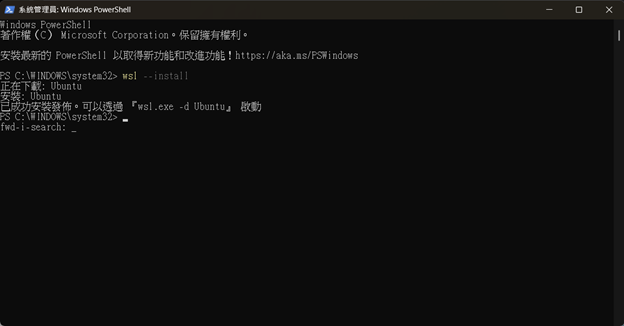
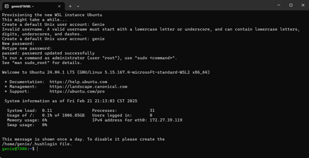
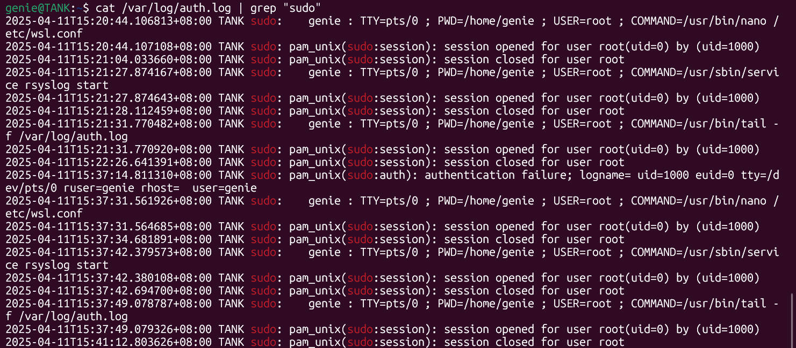
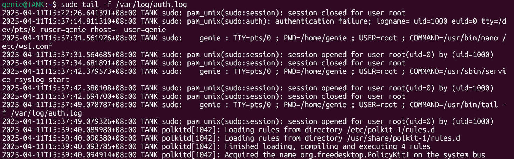
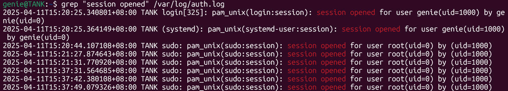
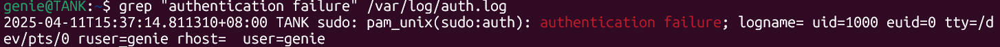
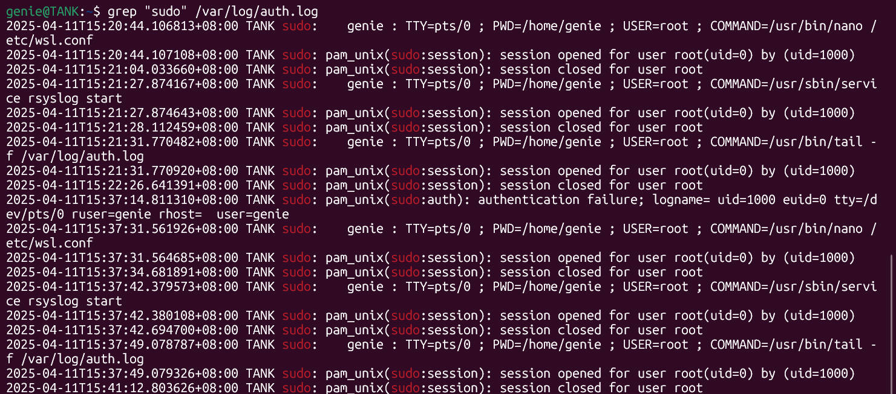

# Cybersecurity Homework 3-1

> Course No: MI5318701
>
> Course Name: 資訊系統與作業安全 Information System and Operational Security
>
> Professor: 邱建樺
>
> Author:
>
> - 張皓鈞 Hayden Chang (B11030202)
> - 鄭健廷 Allen Cheng (B11130225)
> - 高靜宜 Genie Gao (M11309208)

## 目錄

[toc]


## 理解並觀察 Linux 系統的身份驗證與操作日誌

本次目標為學習並理解 Linux 系統中的日誌記錄功能，透過觀察 `/var/log/auth.log`，熟悉系統如何記錄身份驗證與權限操作的事件。

作業目標

- 查找 **登入成功** 的紀錄
- 查找 **登入失敗** 的紀錄
- 查找 **使用 sudo 指令** 的紀錄


### 1. 實驗環境建置

#### 1.1 使用環境

- 作業系統：Windows 11 Home + WSL2 (Ubuntu 22.04)
- Linux 內核版本：5.15.167.4-microsoft-standard-WSL2
- 啟用 systemd 與 rsyslog：  
  - 在 `/etc/wsl.conf` 中設定 `systemd=true`  
  - 執行 `sudo service rsyslog start` 開啟日誌服務






### 2. 製造登入與權限操作紀錄

#### 2.1 製造登入成功與失敗事件

- 登出並重新登入 WSL2 Ubuntu，會產生登入成功紀錄
- 使用錯誤密碼執行 `sudo`，可觸發登入失敗紀錄（模擬驗證失敗）

#### 2.2 使用 sudo 指令觸發權限事件

```bash
sudo nano /etc/wsl.conf
sudo service rsyslog start
```


### 3. 查閱 /var/log/auth.log 的紀錄內容

#### 3.1 使用 cat 顯示完整日誌內容

我們使用 `cat` 指令直接將 `/var/log/auth.log` 檔案內容顯示出來，以便觀察整體結構與格式。

```bash
cat /var/log/auth.log
```

> **重點說明：**
>
> - 此指令會直接輸出整份 auth.log 的所有紀錄，適合用於了解整體日誌的格式與資料流。若輸出太多建議加上 `| less` 分頁查看。




#### 3.2 使用 tail 持續觀察日誌

```bash
sudo tail -f /var/log/auth.log
```

> **重點說明：**
>
> - 此指令會即時顯示新增到 auth.log 的紀錄，適合觀察當下操作（如 sudo）是否有被系統記錄。




#### 3.3 查找登入成功紀錄

```bash
grep "session opened" /var/log/auth.log
```

> **重點說明：**
>
> - 這條指令會找出成功登入使用者 shell 的紀錄，例如：  
>   `pam_unix(systemd-user:session): session opened for user genie(uid=1000) by genie(uid=0)`  
>   表示帳號 genie 成功開啟 session。



#### 3.4 查找登入失敗紀錄

```bash
grep "authentication failure" /var/log/auth.log
```

> **重點說明：**
>
> - WSL2 下輸入錯誤密碼並不會出現傳統的 "Failed password" 字串，需改抓 "authentication failure"。  
>   此輸出通常會顯示驗證失敗原因及呼叫的模組。




#### 3.5 查找 sudo 操作紀錄

```bash
grep "sudo" /var/log/auth.log
```

> **重點說明：**
>
> - 此指令可查詢所有透過 sudo 執行的命令紀錄，例如：  
>   `genie : TTY=pts/0 ; PWD=/home/genie ; USER=root ; COMMAND=/usr/bin/nano /etc/wsl.conf`  
>   表示使用者 genie 嘗試以 root 權限執行 nano。




#### 3.6 使用 cat 查找 sudo 操作紀錄

```bash
cat /var/log/auth.log | grep "sudo"
```

> **重點說明：**
>
> -使用 grep 搭配 cat 將內容過濾，可只留下 sudo 操作相關紀錄


### 4. 心得與討論

透過本次實驗，我們學習到 Linux 系統的 `/var/log/auth.log` 能詳細記錄與身份驗證、權限 sudo 操作相關的事件，對於資安事件的追蹤與偵測有極大幫助。

WSL2 搭配 systemd + rsyslog 的方式，讓我們能在軟體處理器經營的環境中實踐 Linux 真實日誌功能。並且透過 grep 指令查找關鍵字，能高效率運算依照套裝的觀察項目。

sudo 操作紀錄記錄了用戶名稱、操作位置與指令內容，其可統計性與可編譯性很高；登入成功與失敗紀錄則有助分析當前是否有異常登入或錯誤試載。

這次實作不僅讓我們熟悉了 Linux 日誌系統的基本架構，也展現了如何透過操作和日誌的連動來分析系統行為與失敗資訊，實用性高，是未來實務執行資安監控與回溯分析不可或缺的技術。