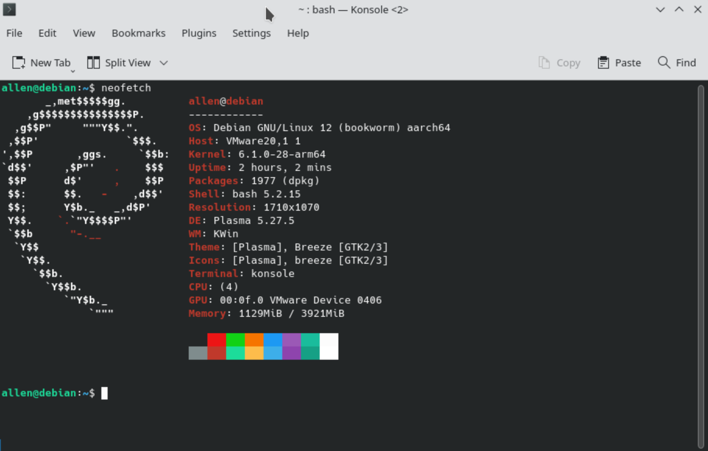
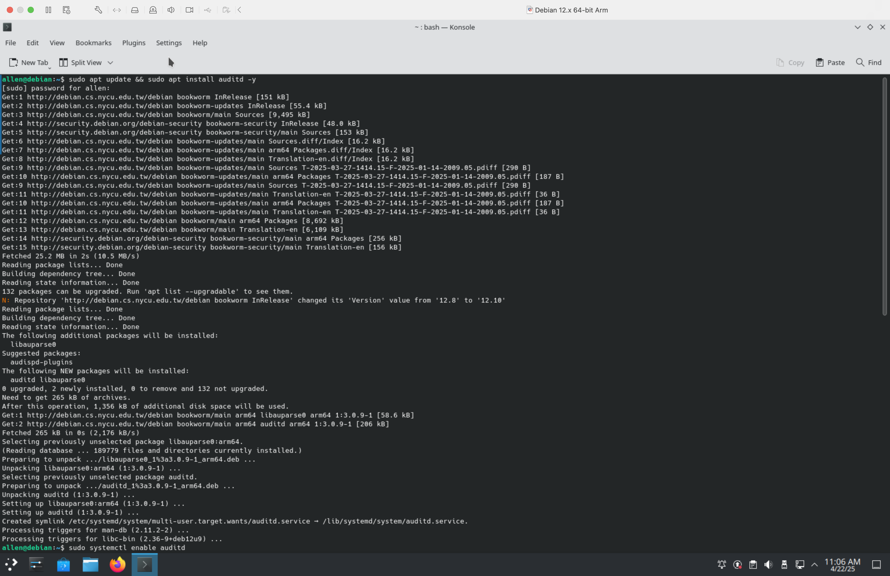
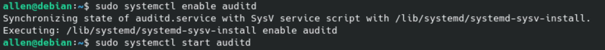
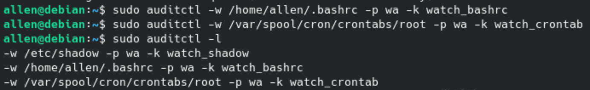
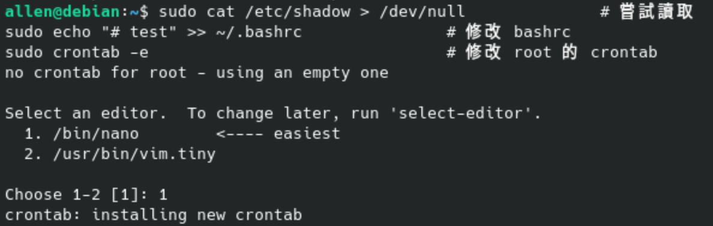
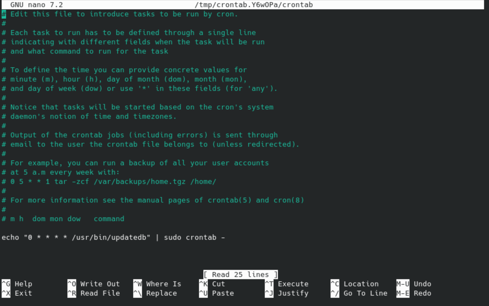
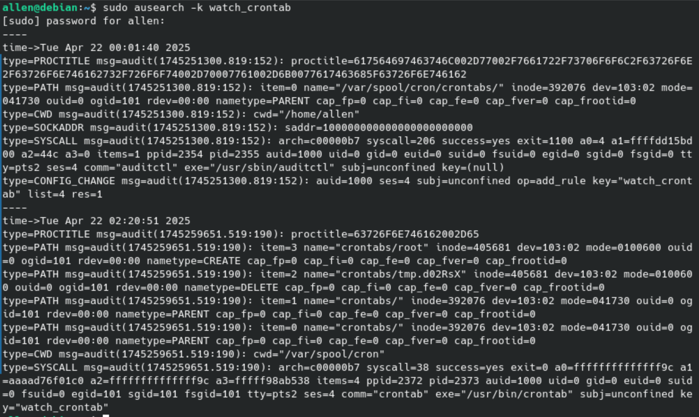

# 🛡️ Cybersecurity Homework 3-2

> Course No: MI5318701
>
> Course Name: 資訊系統與作業安全 Information System and Operational Security
>
> Professor: 邱建樺
>
> Author:
>
> - 張皓鈞 Hayden Chang (B11030202)
> - 鄭健廷 Allen Cheng (B11130225)
> - 高靜宜 Genie Gao (M11309208)

## 目錄

[toc]

### 📘 作業目標

> 透過 Linux Audit Framework（auditd）監控重要系統檔案的存取與異動行為。

學習 `auditd` 的基本操作，透過稽核規則來監控以下檔案是否被**讀取或修改**：

- `/etc/shadow`（儲存使用者密碼雜湊的檔案）
- `~/.bashrc`（使用者的 shell 啟動腳本）
- `/var/spool/cron/crontabs/root`（root 使用者的 crontab 設定）

### ⚙️ 1. 環境建置

- 作業系統：Debian 12
- 啟用 systemd 支援（via `/etc/wsl.conf`）
- 啟用 `auditd`：

```bash
sudo apt update && sudo apt install auditd audispd-plugins -y
sudo systemctl start auditd
sudo systemctl enable auditd
```







------

### 📝 2. 設定監控規則

```bash
# 監控 /etc/shadow 的讀寫行為
sudo auditctl -w /etc/shadow -p wa -k watch_shadow

# 監控 ~/.bashrc 的讀寫行為（記得換成實際使用者）
sudo auditctl -w /home/YOUR_USERNAME/.bashrc -p wa -k watch_bashrc

# 監控 root 的 crontab 設定
sudo auditctl -w /var/spool/cron/crontabs/root -p wa -k watch_crontab
```

確認目前的規則：

```bash
sudo auditctl -l
```



------

### 🧪 3. 測試觸發事件

```bash
# 讀取 /etc/shadow
sudo cat /etc/shadow > /dev/null

# 修改 ~/.bashrc
echo "# test" >> ~/.bashrc

# 修改 root 的 crontab（會開啟編輯器）
sudo crontab -e
```





------

### 🔍 4. 查詢稽核記錄

```bash
sudo ausearch -k watch_shadow
sudo ausearch -k watch_bashrc
sudo ausearch -k watch_crontab
```

你也可以使用 `aureport` 查看彙總報告：

```bash
sudo aureport -f    # 檔案存取紀錄彙整
```



------

### 🧠 心得與討論

透過這次的實驗，我們學習到 **Linux** 系統的 `auditd` 能夠更細緻地監控檔案層級的異動行為，與 `/var/log/auth.log` 互補使用，可大幅提升對系統活動的可觀測性。尤其對於像 `/etc/shadow`、root 的排程等敏感資源，`auditd` 提供了即時的稽核與追蹤功能。過程中操作 `GNU Nano`的editor是看起來很厲害但是實際很基本的部份，在快樂的邊玩邊學習這次作業的過程中都覺得自己是不是強得可怕的駭客，但其實沒有ＸＤ。