# Cybersecurity Homework 4

> Course No: MI5318701
>  
> Course Name: 資訊系統與作業安全 Information System and Operational Security  
> 
> Professor: 邱建樺  
>
> Author: 
> 
> - 張皓鈞 Hayden Chang (B11030202)  
> - 鄭健廷 Allen Cheng (B11130225)  
> - 高靜宜 Genie Gao (M11309208)

## 目錄

[toc]


## 實作目標：建置與理解 ELK SIEM 系統架構

本次作業目標是實際建置 ELK SIEM（Elasticsearch, Logstash, Kibana, Security Information and Event Management）系統，了解其核心組件與資料流動方式。我們依序安裝並設定下列元件：

- Elasticsearch  
- Kibana  
- Fleet Server  
- Elastic Agent（Linux 與 Windows 端點）  
- 整合並觀察資料於 Kibana Dashboard 中之呈現  
- 撰寫簡易的 KQL 查詢以驗證資料正確性與搜尋功能  


### 1. 安裝與啟動 Elasticsearch

Elasticsearch 為 ELK 架構的核心，負責儲存與搜尋索引資料。

ELK Stack 的核心元件皆部署於一台 Ubuntu 24.04 虛擬機中，此虛擬機為 Proxmox VE 平台上的 VM 100，命名為 elk-siem。透過 neofetch 可觀察其系統資源與環境設定。

> **重點說明：**
>
> - 主機資訊：這是 elk-siem 這台虛擬機的主控台畫面，運行的是 Ubuntu 24.04.2 LTS。
> - neofetch 輸出：顯示系統資訊如下：
>   OS：Ubuntu 24.04.2 LTS
>   Kernel：6.8.0-59-generic
>   CPU：Intel Core i5-12400（6核12緒）
>   RAM：7.5 GiB / 7.8 GiB（96%）
>   IP 位址：192.168.1.106
> - Proxmox VE 左側架構：顯示目前有多台虛擬機，包含 elk-siem（100）、storeos、elk-win11 等。 
> - 主控台操作記錄：顯示 root@pam 進行的啟動或變更操作。

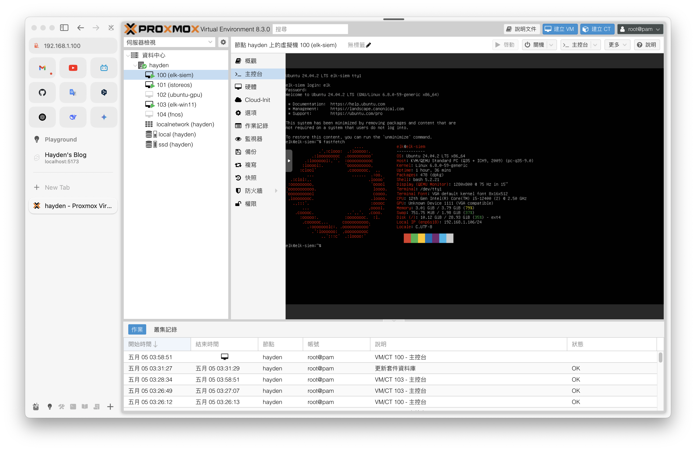


### 2. 安裝與設定 Kibana

Kibana 是用來視覺化 Elasticsearch 資料的工具，支援 Dashboard、Discover 與 SIEM 模組等。

> **重點說明：**
>
> - Kibana 提供直觀的圖形介面，方便使用者進行資料探索與視覺化。
> - 透過 Kibana，可建立自訂的 Dashboard，以監控系統指標與安全事件。
> - 支援 KQL（Kibana Query Language），進行進階資料查詢與分析。

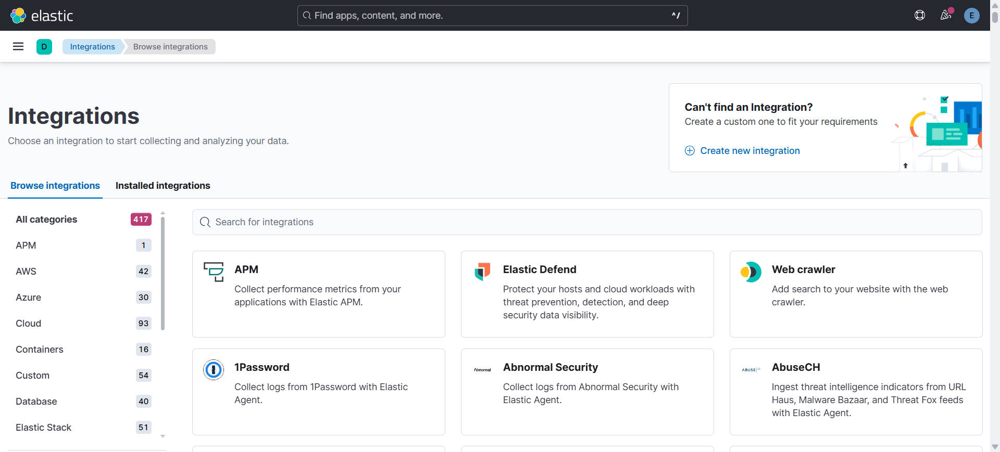

#### 2.1 前置作業（下載 GPG 金鑰與設定套件來源）

```bash
sudo apt update
sudo apt install -y apt-transport-https curl gnupg
curl -fsSL https://artifacts.elastic.co/GPG-KEY-elasticsearch | sudo gpg --dearmor -o /etc/apt/trusted.gpg.d/elastic.gpg
echo "deb [signed-by=/etc/apt/trusted.gpg.d/elastic.gpg] https://artifacts.elastic.co/packages/8.x/apt stable main" | \
  sudo tee /etc/apt/sources.list.d/elastic-8.x.list
sudo apt update
```

#### 2.2 安裝 Elasticsearch

```bash
sudo apt install elasticsearch
```


初次安裝產生的密碼：`ImYFfIMhpz*lDaL5oGMs`

#### 2.3 編輯設定檔

```bash
sudo hx /etc/elasticsearch/elasticsearch.yml
```

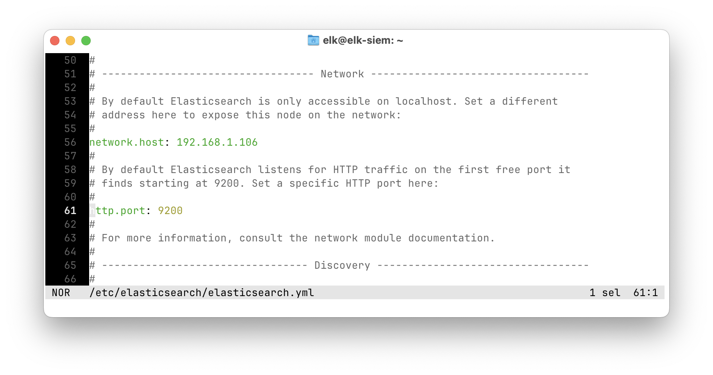

#### 2.4 開機啟動

```bash
sudo systemctl enable elasticsearch
```

#### 2.5 啟動程式

```bash
sudo systemctl start elasticsearch
```

#### 2.6 查看運行狀態

```bash
sudo systemctl status elasticsearch
```

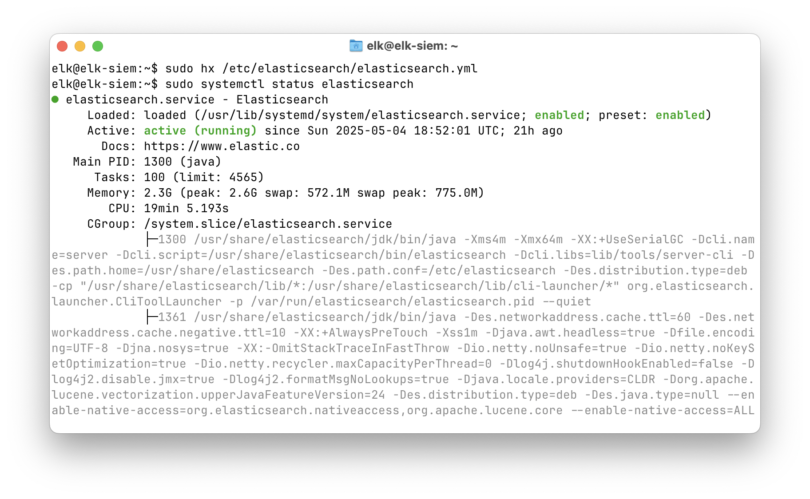

#### 2.7 測試是否運作成功

```bash
curl -k https://localhost:9200 -u elastic
```

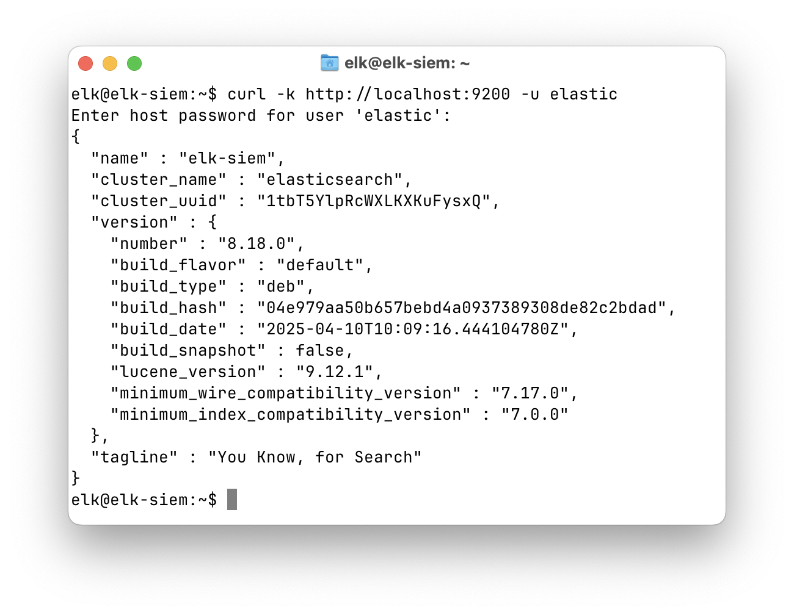

### 3. 安裝 Kibana

#### 3.1 安裝 Kibana

```bash
sudo apt install kibana
```

#### 3.2 設定 kibana_system 帳號的密碼 (透過 elasticsearch API)

```bash
sudo curl -X POST https://localhost:9200/_security/user/kibana_system/_password \
  -u elastic \
  -H "Content-Type: application/json" \
  -d '{"password": "KibanaPass123!"}' \
  --cacert /etc/elasticsearch/certs/http_ca.crt
```

#### 3.3 測試 kibana_system 帳號密碼

```bash
curl -k https://localhost:9200 -u kibana_system
```

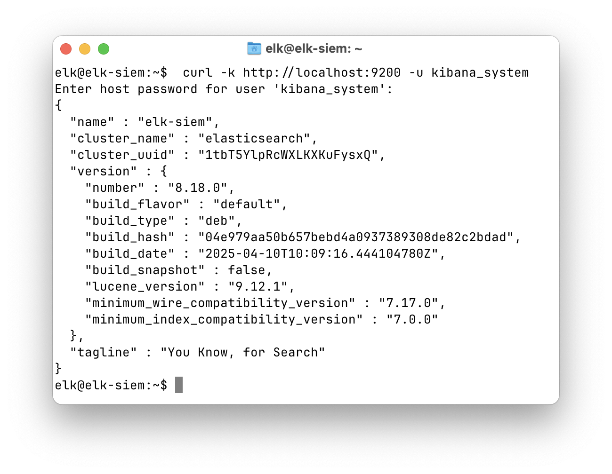

#### 3.4 編輯 Kibana 設定檔

```bash
sudo hx /etc/kibana/kibana.yml
```

```
server.host: "0.0.0.0"
elasticsearch.hosts: ["https://localhost:9200"]
elasticsearch.username: "kibana_system"
elasticsearch.password: "KibanaPass123!"
elasticsearch.ssl.verificationMode: none
```

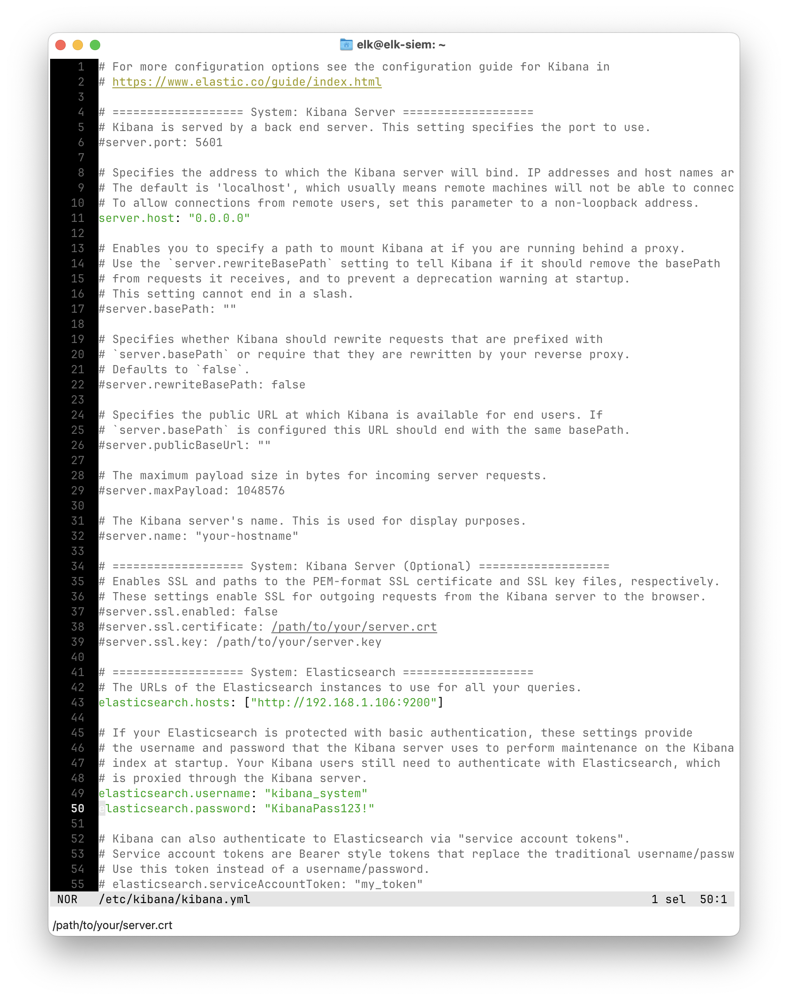

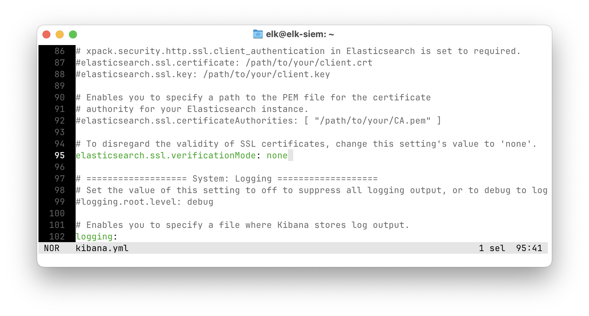

#### 3.4 設為開機自動啟動

```bash
sudo systemctl enable kibana
```

#### 3.5 啟動程式

```bash
sudo systemctl start kibana
```

#### 3.6 查詢啟動執行狀況

```bash
sudo journalctl -u kibana.service -f
```

#### 3.7 測試是否運作成功

- 查詢 `5601` 端口是否啟用

  ```bash
  ss -tulnp | grep 5601
  ```

  ```
  tcp   LISTEN 0      511                                0.0.0.0:5601      0.0.0.0:*
  ```

- 測試 Web 是否可以訪問

  ```bash
  curl -I http://localhost:5601
  ```

  ```
  HTTP/1.1 302 Found
  location: /login?next=%2F
  x-content-type-options: nosniff
  referrer-policy: strict-origin-when-cross-origin
  permissions-policy: camera=(), display-capture=(), fullscreen=(self), geolocation=(), microphone=(), web-share=()
  cross-origin-opener-policy: same-origin
  content-security-policy: script-src 'report-sample' 'self'; worker-src 'report-sample' 'self' blob:; style-src 'report-sample' 'self' 'unsafe-inline'
  content-security-policy-report-only: form-action 'report-sample' 'self'
  kbn-name: elk-siem
  kbn-license-sig: 3d2445a793288e80a423e3f455a94598e67d64aed945e49bb1567287759c8ce4
  cache-control: private, no-cache, no-store, must-revalidate
  content-length: 0
  Date: Mon, 05 May 2025 19:06:22 GMT
  Connection: keep-alive
  Keep-Alive: timeout=120
  ```


### 4. 建立 Fleet Server 與註冊 Elastic Agent

#### 4.1 安裝 Fleet Server

- Linux Tar

  ```bash
  curl -L -O https://artifacts.elastic.co/downloads/beats/elastic-agent/elastic-agent-8.18.0-linux-x86_64.tar.gz 
  tar xzvf elastic-agent-8.18.0-linux-x86_64.tar.gz
  cd elastic-agent-8.18.0-linux-x86_64
  sudo ./elastic-agent install --url=https://192.168.1.106:8220 --enrollment-token=LUdESG5KWUI1TTdZQ0xLYW5LZVc6VElkcU1GUFM1SVBRaGlQSGlnUVV6QQ==
  ```

- Windows

  ```powershell
  $ProgressPreference = 'SilentlyContinue'
  Invoke-WebRequest -Uri https://artifacts.elastic.co/downloads/beats/elastic-agent/elastic-agent-8.18.0-windows-x86_64.zip -OutFile elastic-agent-8.18.0-windows-x86_64.zip 
  Expand-Archive .\elastic-agent-8.18.0-windows-x86_64.zip -DestinationPath .
  cd elastic-agent-8.18.0-windows-x86_64
  .\elastic-agent.exe install --url=https://192.168.1.106:8220 --enrollment-token=LUdESG5KWUI1TTdZQ0xLYW5LZVc6VElkcU1GUFM1SVBRaGlQSGlnUVV6QQ==
  ```


#### 4.2 檢查 Fleet 管理介面

在 Elastic Stack 架構中，Fleet 是用來管理 Elastic Agent 的集中式控制台，負責監控所有已註冊的 Agent 運行狀態、健康度與資料流量。
進入 Kibana Fleet 管理介面，我們可以看到目前的兩台已註冊的 Elastic Agent 狀態。

> **重點說明：**
>
> - 已連線的 Agent（狀態 Healthy）：
>   elk-win11（使用 windows-policy）
>   elk-siem（使用 Fleet Server Policy）
> - 系統指標：
>   CPU 使用率：低於 1%
>   記憶體使用：約 200MB
>   Elastic Agent 版本：8.18.0
>   最後活動時間：幾秒鐘前（顯示 agent 正常運作）
> - Fleet 的用途與意義：
>   集中管理所有 Elastic Agent，包括 Linux 與 Windows 主機。
>   即時監控 Agent 狀態，確保 Agent 正常上傳日誌與系統指標。
>   政策（Policy）管理：不同 Agent 可套用不同的資料收集策略，如 Windows 系統日誌與 Linux Metrics。
> - 本次實作驗證結果：
>   目前兩台主機 (elk-siem 和 elk-win11) 都已成功註冊並正常運作，顯示 ELK 架構已經成功整合。

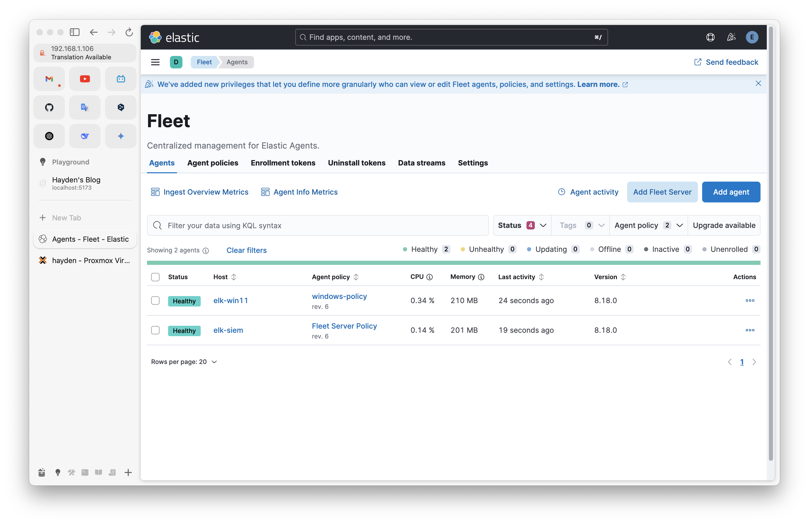


#### 4.3 瀏覽資料流（Data Streams）畫面

完成 Elastic Agent 註冊與 Fleet 管理設定後，接著需要確認資料是否已被成功寫入 Elasticsearch。最直接的方式就是查看 Data Streams（資料流）畫面，它能夠清楚顯示來自各個 Agent 的資料來源、類型與整合模組。

> **重點說明：**
>
> - 畫面說明：
>   Dataset 名稱：如 system.cpu、system.memory、windows.perfmon 等
>   Type：分為 metrics（系統指標）與 logs（日誌）
>   Namespace：通常為 default，可依需求劃分命名空間
>   Integration：顯示該資料是來自哪個整合模組（如 system 或 windows）
>   最後活動時間：確認資料是否持續上傳中
>   資料大小（Size）：反映資料量的成長
> - 用途與意義：
>   快速掌握目前有哪些 Dataset 正在由 Elastic Agent 傳送回 Elastic Stack
>   可用於監控與偵錯，例如：
>     檢查 system.cpu 是否成功收集 CPU 使用率資料
>     檢查 windows.perfmon 是否成功收集效能計數器
>   可依不同維度（類型、來源、命名空間）進行管理與過濾

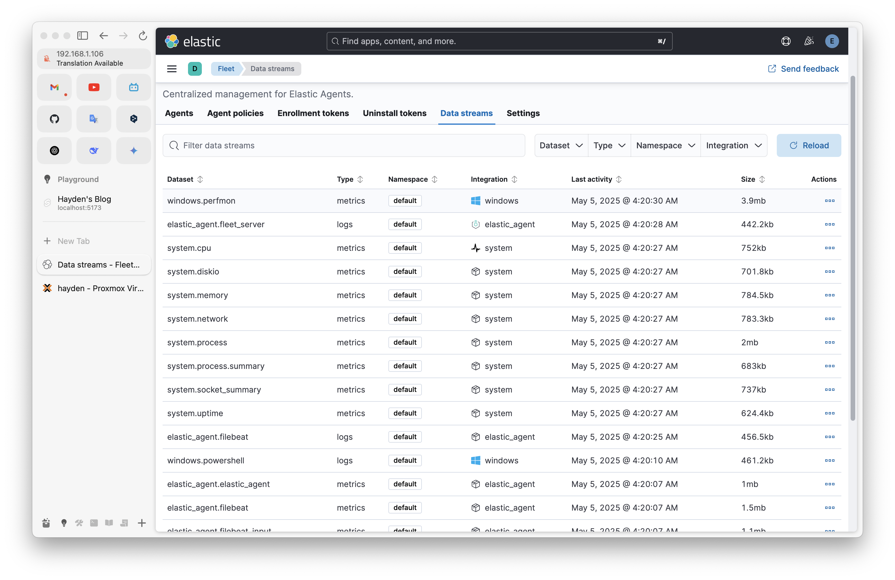


### 5. Linux 主機安裝 Elastic Agent

在 `elk-siem`（Ubuntu）主機上安裝 Elastic Agent，並連線至已建立的 Fleet Server。

安裝步驟：
- 前往 Kibana → Fleet → Add Agent，選擇 Platform 為 Linux 並選擇安裝方式。
- 依據畫面指示複製指令，並於 elk-siem 終端機中執行。
- 安裝完成後，Agent 會自動啟動並連線至 Fleet Server。

```bash
curl -L -O https://artifacts.elastic.co/downloads/beats/elastic-agent/elastic-agent-8.18.0-linux-x86_64.tar.gz
tar xzvf elastic-agent-8.18.0-linux-x86_64.tar.gz
cd elastic-agent-8.18.0-linux-x86_64
sudo ./elastic-agent install --url=https://<fleet-server-ip>:8220 --enrollment-token=<your-token> --insecure
```
> **重點說明：**
>
> - 若未使用正式憑證，需加上 --insecure 選項以繞過 HTTPS 驗證。


### 6. 確認 Linux Agent 上線

#### 6.1 查看 Agent 詳細狀態

在完成 Elastic Agent 安裝與連接 Fleet Server 之後，可透過 Fleet 管理介面查看各 Agent 的詳細狀態，以確認其健康情況與系統資源耗用。

> **重點說明：**
>
> - 畫面說明：
>   Agent 名稱：elk-siem
>   狀態：Healthy（顯示目前運作正常）
>   CPU 使用率：0.13%，記憶體使用：201 MB
>   系統資訊：Ubuntu 平台、版本 8.18.0、以 root 權限執行
>   日誌與指標監控：已啟用
>   所屬政策：Fleet Server Policy
>   顯示 Agent ID、主機名稱、最後活動時間等重要資訊
> - 用途與意義：
>   幫助使用者快速掌握 Agent 是否正常執行
>   若系統資源異常或 Agent 離線，可第一時間進行排查
>   適用於監控環境的健全性管理與資源分析

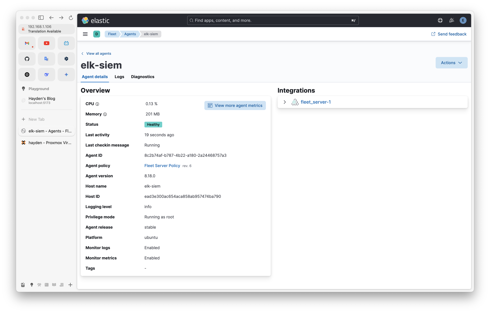


#### 6.2 監控 Agent 指標與效能

完成 Agent 安裝與連線後，Elastic 提供可視化的 Metrics Dashboard 以即時掌握每一台 Agent 的效能表現與系統資源狀況。

> **重點說明：**
>
> - 畫面說明：
>   Agent 名稱：elk-siem
>   運行時間：24 分鐘
>   傳送狀況：Metrics / Logs 的速率顯示正常，無 Output Errors
>   延遲指標：Write Latency 僅 0.01 秒
>   資源狀況：右下角儀表板顯示 CPU、記憶體使用率、CPU Throttling、佇列最大使用率等資訊
> - 用途與意義：
>   有助於快速排除效能瓶頸或傳輸延遲問題
>   是維運工程師進行健康檢查與資源監控的重要工具
>   提供近乎即時的系統回饋，確保 ELK 架構穩定運作

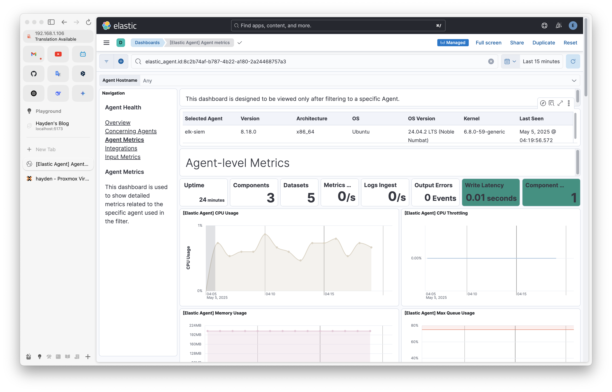


### 7. Windows 主機安裝 Elastic Agent

為模擬企業中常見的日誌來源設備，我們於 Proxmox VE 建立一台 Windows 11 IoT Enterprise LTSC 虛擬機，命名為 `elk-win11`，用於安裝 Elastic Agent 並上傳日誌至 ELK Stack。


> **重點說明：**
>
> - 主機資訊：虛擬機 elk-win11 運行 Windows 11 IoT Enterprise LTSC。
> - fastfetch 輸出（PowerShell）：
>   OS：Windows 11 IoT LTSC x86_64
>   Kernel：10.0.26010
>   CPU：Intel Core i5-12400
>   RAM：2.6 GiB / 3.9 GiB
>   磁碟使用：
>     C:\：使用 19.3 GiB（62%）
>     D:\、E:\：為 UDF/CFPS 格式（外接/只讀），顯示 100% 使用
>   IP 位址：192.168.1.113
> - 此機器為日誌來源之一，安裝 Elastic Agent 後將傳送事件與系統指標至 ELK Stack。

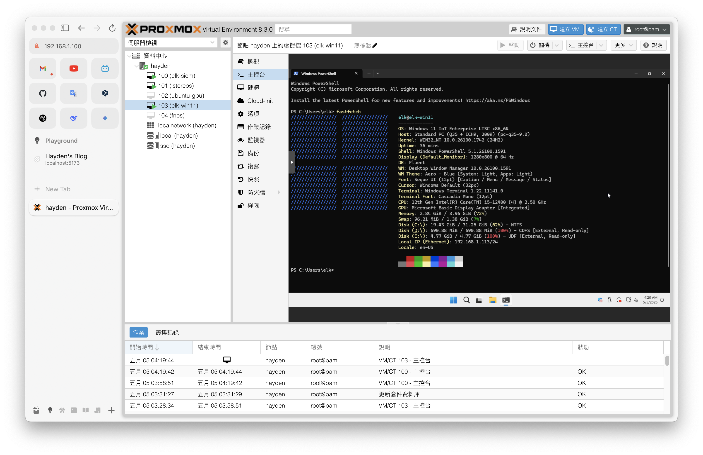


### 8. 確認 Windows Agent 上線

#### 8.1 檢視 Windows Agent 詳細資訊

除了 Fleet Server 所在的 Linux 主機（elk-siem），Windows 主機（elk-win11）同樣安裝了 Elastic Agent，並採用名為 windows-policy 的資料收集政策。以下為該 Agent 的詳細資訊畫面：

> **重點說明：**
>
> - 畫面說明：
>   CPU：0.35%使用率
>   Memory：使用約210MB
>   Status：Healthy
>   Last activity：28秒前
>   Agent policy：windows-policy
>   Agent version：8.18.0
>   Privilege mode：root權限運行
>   Platform：Windows
>   Logs / Metrics 監控：已啟用

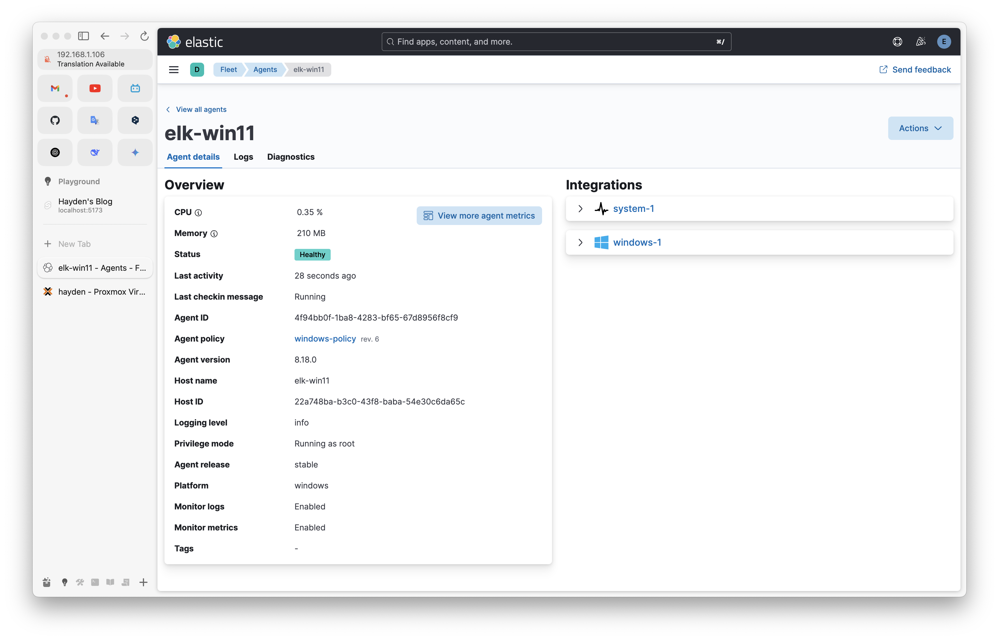


#### 8.2 監控 Windows Agent 運作效能

為確保 Elastic Agent 在 Windows 系統上穩定運作，我們可透過 Dashboard 即時監控其效能與資料收集狀況。

> **重點說明：**
>
> - 畫面說明：
>   Uptime：運行 24 分鐘
>   Metrics Ingest：每秒38筆指標
>   Logs Ingest：每秒38筆日誌
>   Output Errors：無錯誤事件
>   Write Latency：僅0.02秒
>   CPU 使用率：約0.5%～1.5%
>   記憶體使用：約265MB
>   CPU Throttling / Max Queue Usage：無限制情況，佇列正常

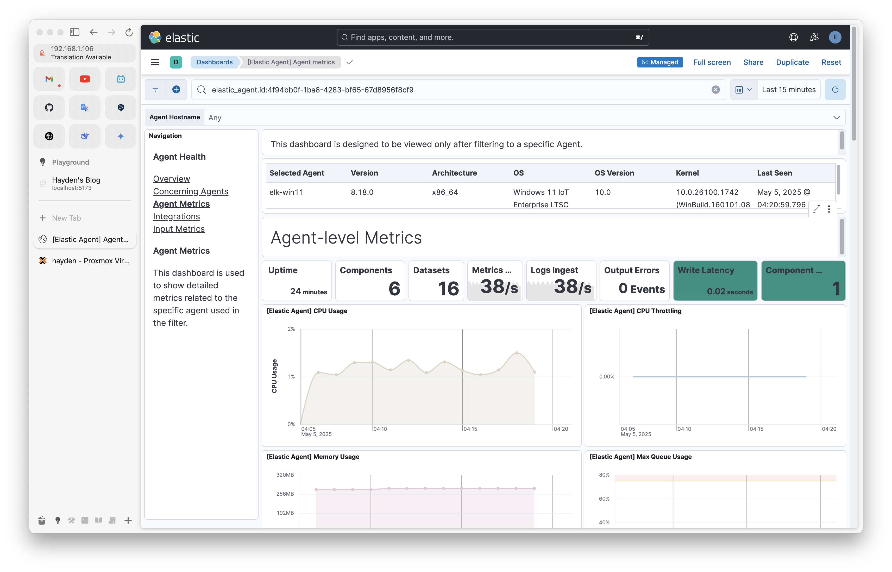


### 9. 查看 Discover 與資料索引狀況

完成 Elastic Stack 架構建置與 Agent 部署後，即可利用 Kibana 的 Discover 工具查閱實際收集到的日誌資料。

> **重點說明：**
>
> - 畫面說明：
>   每筆資料代表一個事件記錄，主要欄位包括：
>   @timestamp：事件產生的精確時間
>   agent.name：來源主機名稱（如 elk-win11）
>   agent.type：Elastic Agent 類型（如 filebeat）
>   component.dataset：資料來源模組（如 fleet-server）
>   component.binary, component.id：事件產生的元件資訊
> - 用途與意義：
>   可進行日誌事件篩選、查詢與排錯
>   搭配 KQL（Kibana Query Language）搜尋特定行為、錯誤或異常活動
>   為資安分析與系統維運提供基礎資料源

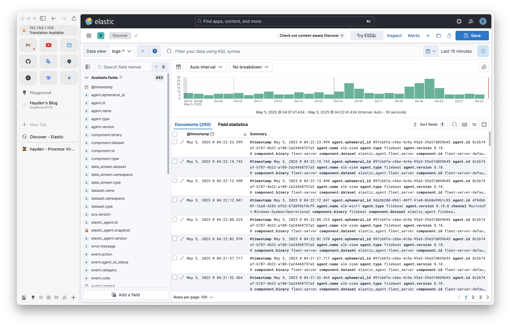


### 10. 撰寫 KQL 查詢進行資料搜尋

利用 Kibana Discover 功能與 KQL 查詢語法，篩選出 Windows 安全性日誌中的成功登入事件（event.code: 4624）。

```kql
event.code: "4624" and winlog.channel: "Security"
```

> **重點說明：**
>
> - 畫面說明：
>   中央區域 顯示時間分布圖，協助快速判斷異常登入活動是否集中在特定時段
>   下方 Documents 區 顯示查詢結果，包括欄位如 @timestamp, event.code, agent.name, data_stream.dataset 等
> - 實際應用場景：
>   安全稽核與入侵偵測（例如：非上班時間大量 4624 事件）
>   建立 SIEM 規則與警示
>   追蹤可疑帳號登入行為與來源裝置


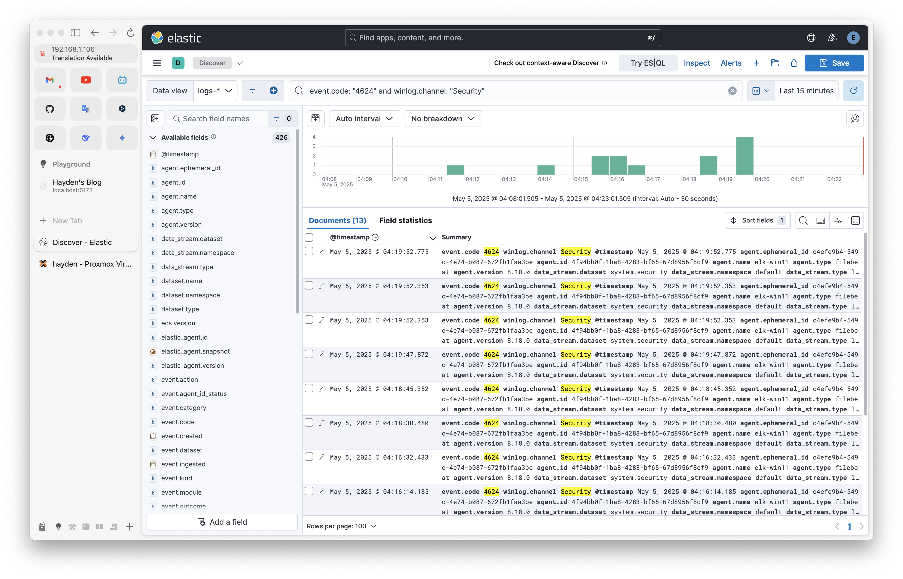

```kql
event.code: "1" and winlog.channel: "Microsoft-Windows-Sysmon/Operational"
```

> **重點說明：**
>
> - 畫面說明：
>   中央區域 顯示時間分布圖（Histogram），可視覺化事件發生時間，協助快速判斷是否有異常活動集中於特定時段  
    下方 Documents 區 顯示符合查詢條件的事件清單，包括欄位如 @timestamp, event.code, winlog.channel, agent.name, data_stream.dataset 等  
    左側欄位區 提供可選欄位清單（Available fields），可勾選特定欄位以便聚焦分析重點資訊  
  - 實際應用場景：
    安全稽核與入侵偵測（例如：大量 Sysmon Event ID 1 的行程建立行為可能為惡意程式活動）  
    建立 SIEM 規則與警示（例如：當特定帳號在異常時間建立可疑行程）  
    調查與溯源攻擊事件（例如：從行程建立紀錄追蹤勒索軟體的初始執行路徑）  
    驗證端點監控系統（如 Elastic Agent）是否成功收集並上傳 Sysmon 日誌

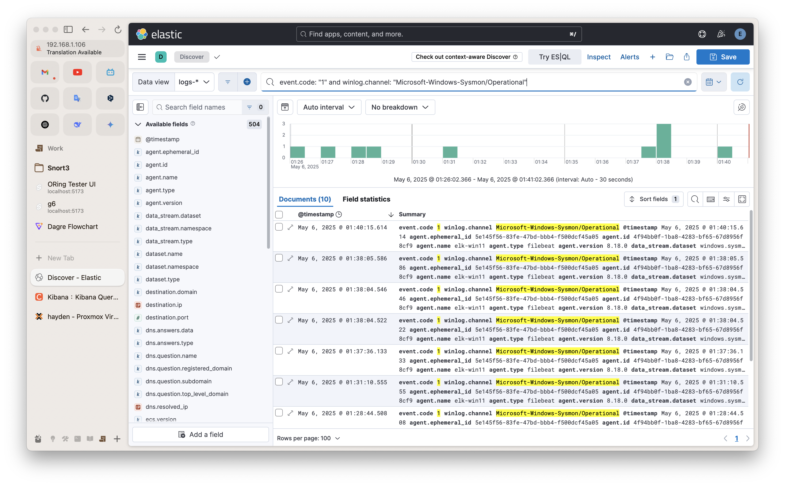

### 11. KQL 事件查詢

#### 11.1 Linux 事件查詢

- 查詢 `elk` 用戶的所有事件

  ```
  event.module: "auditd" and user.name: "elk"
  ```

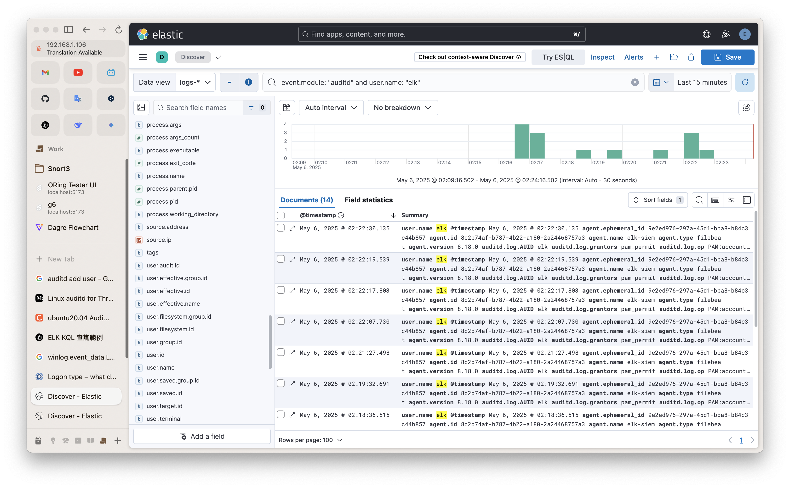

- 查詢 `sudo` 命令的使用紀錄

  ```kql
  event.module : "auditd" and process.executable.text: "*sudo*"
  ```

 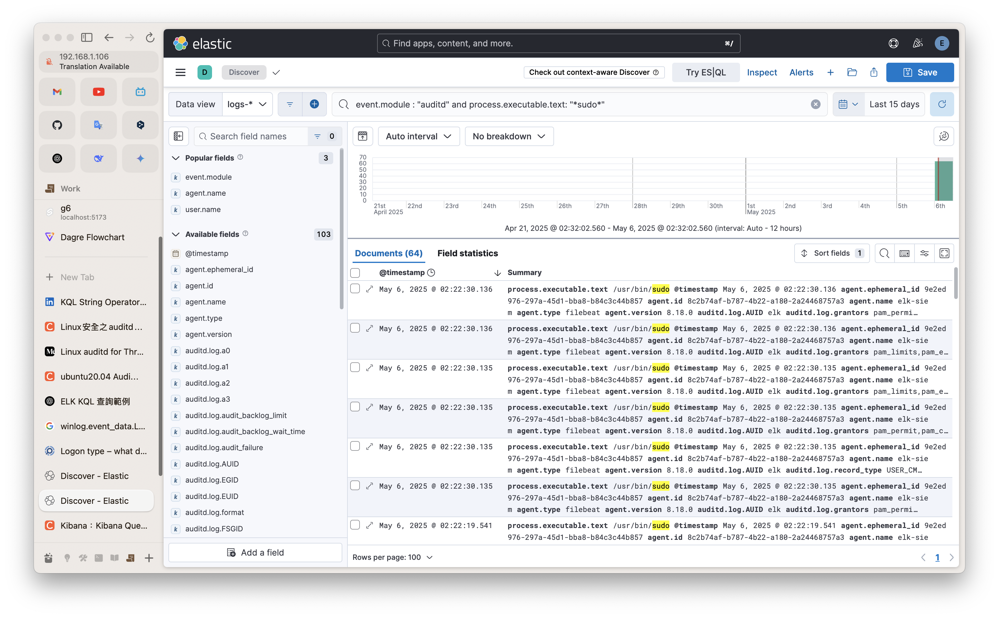

#### 11.2 Windows 事件查詢

- 查詢系統登入成功紀錄

  ```kql
  event.code : "4624" and winlog.event_data.LogonType : "5"
  ```

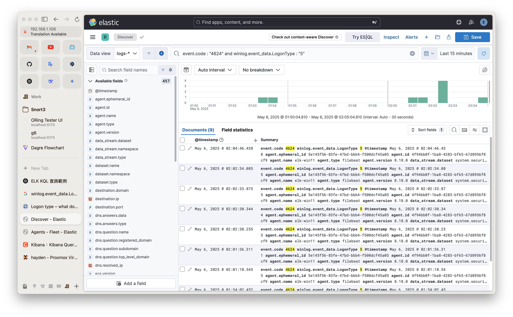

- 查詢登入失敗的紀錄

  ```kql
  event.code: "4625"
  ```

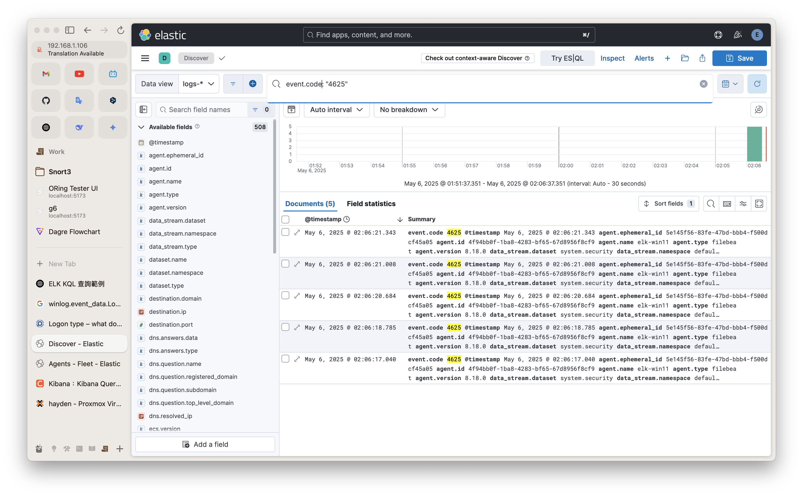

### 12. 心得與結論

​	透過本次實作，我們深入了解並成功建置了 ELK Stack 的核心架構，包括 Elasticsearch、Kibana、Fleet Server 與 Elastic Agent，並分別在 Linux 與 Windows 主機上完成了 Agent 安裝與註冊。整體過程中，雖遇到版本相依性、資源消耗與網路設定等挑戰，但在小組協作與反覆測試下，最終成功讓整個 SIEM 系統穩定運作。

​	特別是在 Fleet 與 Elastic Agent 的整合部分，我們更進一步理解到現代資安監控架構的彈性與集中管理的效率。例如：透過 Fleet Policy 可以統一設定日誌與指標收集模組，並即時監控 Agent 的狀態與效能，這對於大型企業或多主機環境的資安管理具有極高實用價值。

​	此外，藉由實際瀏覽 Data Streams、Discover 與撰寫 KQL 查詢，我們不僅體驗到資料如何從端點流入 Elasticsearch，還能透過 Kibana 進行有效的視覺化分析與查詢操作。這樣的流程使我們更能體會「資料可視化」在資安事件調查中的關鍵地位。

​	這次作業不僅增進了我們對 SIEM 系統架構與原理的理解，也強化了實務操作與故障排除的能力。未來若需進行更進階的威脅偵測、自動化回應（SOAR）或結合機器學習進行異常行為分析，ELK Stack 都是一個非常具潛力與可擴充性的基礎平台。